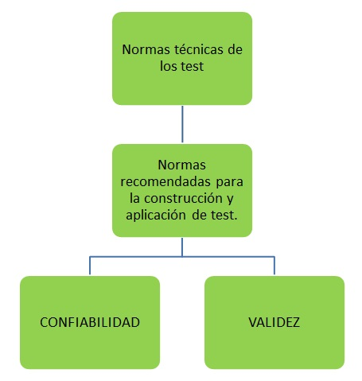
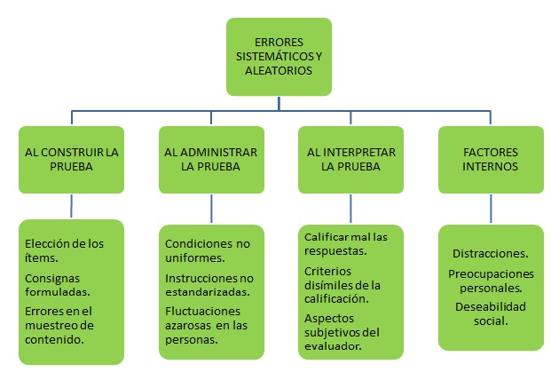
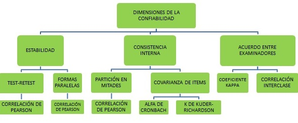

```{r setup, include=FALSE}
knitr::opts_chunk$set(echo = FALSE)
```

## Definición de Test.

Procedimiento por medio del cuál una muestra de comportamiento de un dominio especificado es obtenida y posteriormente calificada,empleando un proceso estandarizado.(APA 1999)


## Normas técnicas de los test.
<center>

</center>

## ¿Qué se busca?

+ **Dar evidencia que la prueba mide lo que se dice  que mide.** 

+ **Dar evidencia que la prueba se encuentra relativamente libre de error, o al menos los factores de error que puede haber cuando hacemos una medición no son de una magnitud tan grande como para afectar un uso válido de esos puntajes.**

## ¿A que hace referencia la confiabilidad?

La confiabilidad hace al concepto de error, en que medida esa puntuación que yo estoy obteniendo se encuentra libre de error o al menos no se ve seriamente afectada por factores de error.

## Errores sistemáticos y aleatorios.

<center>

</center>

## Axioma base para la teoría clásica de los test.


Cada vez que se aplica un instrumento en resumen hay una enumerable cantidad de factores que pueden hacer que varien las puntuaciones de esa prueba no debidas al atributo sino a otros factores.

Por lo tanto lo anterior es la base de lo que se denomina teoría clásica de los test(TCT). Desde la teoría clasica de los test se sostiene que:

<center>
$P_{o} = P_{v} + Error$
</center>


+ $P_{o}$ es el puntaje observado.
+ $P_{v}$ es el puntaje verdadero es decir el puntaje que obtiene la persona si la medición fuera libre de error.

## 

+ Cuando mayor sea el error menos confiable son los resultados obtenidos por la prueba.

+ Error se refiere a cualquier variación en las puntuaciones no debidas al rasgo evaluado.

## Dimensiones de la confiabilidad

Como hay tantas fuentes de error, tantos factores que pueden influir en los puntajes de una prueba, hay diferentes dimensiones y cada dimensión apunta a evaluar, analizar algunas de estas fuentes típicas de error.


## Dimensiones de la confiabilidad

<center>

</center>

## Estabilidad

Evalua el grado en el que el puntaje de un individuo está libre de errores de medición cusados por cambios personales aleatorios del examinado o cambios en las condiciones de administración.

Es decir en que medida los puntajes se pueden ver afectados por cambios azarosos en los examinados. Supongamos que ese día estaba muy triste, poco motivado, no habia dormido bien, no habia desayunado,...

La estabilidad consiste en tomar un test dejar un periodo de tiempo y volver a tomarlo y después comparar los puntajes que se estan obteniendo.


## Estabilidad 

**Test-retest** Se aplica el test se deja pasar un periodo de tiempo y aplico de vuelta el mismo test y después se mira el puntaje que obtienen las personas en está prueba y se correlaciona con los puntajes obtenidos cuando se aplico por primera vez el test.

Si los puntajes son semejantes, eso demuestra que los puntajes son estables en el tiempo.

Generalmente se utiliza el coeficiente de correlación de Pearson para correlacionar los puntajes. Si este coeficiente es superior a 0.8 se considera un criterio óptimo.

**Formas paralelas** Aplicar una prueba que evalue lo mismo es decir una prueba equivalente pero que utilice otro tipo de ítems. Y luego como en el caso test-retest correlacionar los puntajes obtenidos.

## Estabilidad 

Ver artículos:

+ **The Rosemberg Self-Esteem Scale: its Dimensionality Stability and Personality Correlates in Stonian**
+ **Factorial Invariance of a computerized version of the GAD-7 Acroos various demograpic groups and over time in primary care patients**


## Consistencia Interna 

Evalua el grado en que distintas partes o ítems del test miden el mismo constructo o dominio. Indica en que medida la elección de la muestra de ítems que componen la prueba resulta una fuente de error de medición.

La consistencia interna hace referencia a, en que medida diferentes partes del test miden lo mismo, lo que se denomina homogeneidad.

## Consistencia Interna 

 **Partición en mitades** Se divide en dos partes y si los puntajes totales de cada mitad correlacionan de manera alta de alguna manera esas partes de la prueba están mididnedo lo mismo. Sin embargo es un método que poco se usa, ya que tiene bastante dificultades, por ejemplo que criterio se utiliza para dividir las dos partes.

 

## Consistencia Interna

**Covarianza de ítems** covariar hace referencia " en que medida cuando una variable cambia la otra también cambia"lo cuál se hace mediante un procedimiento que los más utilizados son el $\alpha$ **de Cronbach**, cuando las escalas son politomicas y en el caso de ser dicotómicasse utiliza el coeficiente la k de Kuder-Richardson. 

Básicamente lo que se analiza es:

+ Cuando el ítem 1 varia, como varian los demás.

+ Cuando el ítem 2 varia, como varian los demás.

+ Cuando el ítem 3 varia, como varian los demás.

y así sucesivamente.


## Consistencia Interna.

El coeficiente de Cronbach indica el promedio de ese patron de  covarianza.


Cuando ese valor es superior a 0.8 significa que los items estan coavariando en forma homogenea de 0.8 hay una cavarianza optima, es decir que todos lo ítems estan coavariando en la misma dirección y si covarian en la misma dirección están midiendo lo mismo.

Se tiene la siguiente interpretación:

+ 0.8 < $\alpha$ homogeneidad óptima.

+ 0.7 $\leq \alpha$ aceptable.

+ 0.7 $> \alpha$se considera una escala con poca consistencia interna y por ende su uso no es recomendable.


## Acuerdo entre examinadores.

Alude al grado en que la medición de un rasgo es independiente de la subjetividad del evaluador. Se busca determinar si las puntuaciones ontenidas por un sujeto son independientes del examinador.

Esta dimensión no siempre se examina, solamente se estudia el acuerdo entre examinadores cuando es una escala donde hay cierto margen de subjetividad al momento de calificar la prueba.


El acuerdo entre examinadores consiste en pedirle a una serie de jueces que examinen al mismo grupo de personas y después por medio de unos coeficientes estadísticos por ejemplo el coeficiente Kappa o el coeficiente de correlación iterclase, ver el grado de acuerdo que hay entre los examinadores. 

## Acuerdo entre examinadores.

Si en un grupo de examinadores al calificar el mismo conjunto de personas son muy disímiles las evaluaciones que realizan entonces es una prueba que se ve seriamente afectada por la subjetividad de los evaluadores y se deben hacer algunas modificaciones, clarificar criterios para minimizar ese rasgo de subjetividad. 

La  interpretación del coeficiente Kappa o el coeficiente de correlación interclase :

+ 0.8 < $\alpha$  óptimo.

+ 0.7 $\leq \alpha$ aceptable.

+ 0.7 $> \alpha$ es un indicador de que hay que revisar los criterios, posiblemente colocar criterios más claros.

