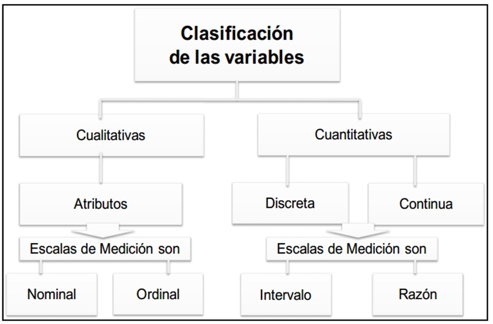
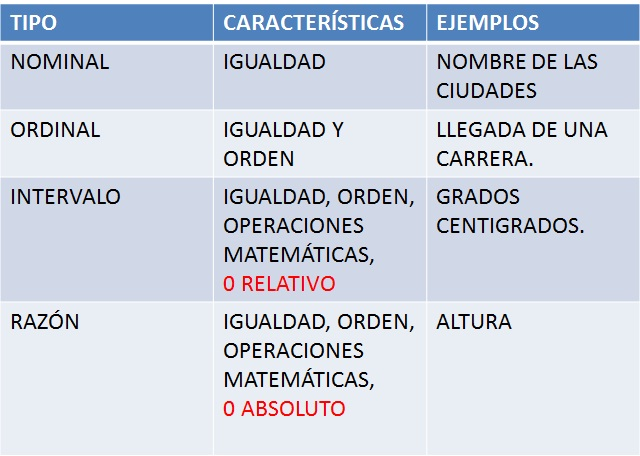
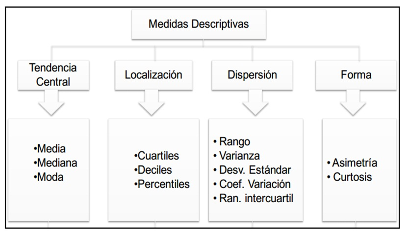
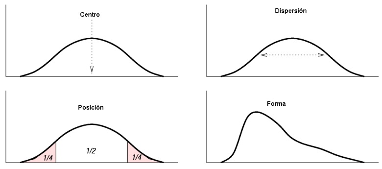
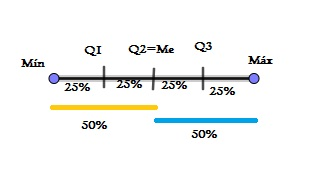
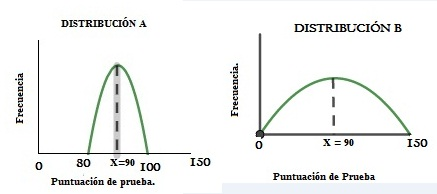
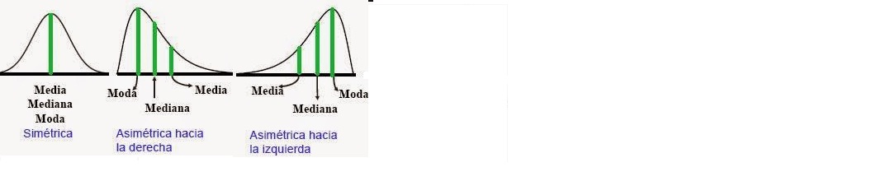
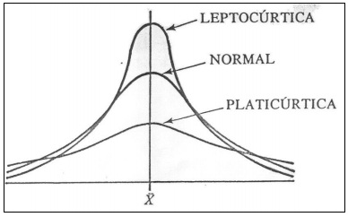
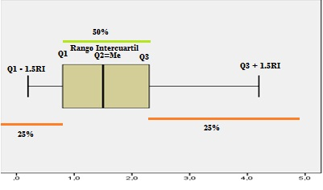

```{r setup, include=FALSE}
knitr::opts_chunk$set(echo = TRUE)
```


<center>
# Estadística Descriptiva
</center>

  
     


## Tipos de variables, según su escala de medida.

Variables cualitativas:son aquellas que toman atributos o cualidades.
Variables cuantitativas: son las  que asumen valores numéricos.

Sin embargo se debe tener cuidado en el contexto que se este tratando por ejemplo, el número de               identificación, el estrato socieconómico  son cualitativas.

<center>



</center>

Una esquema  rápidó de la clasificación de variables es:

<center>

</center>


## Variables dicotómicas y politómicas.


Dicotómicas:cuando sólo pueden tomar dos valores posibles.\\
 
Ejemplos:
    Sexo: femenino, masculino.\\
    Se siente cómodo en clases virtuales: si, no.

Politómicas: cuando pueden adquirir tres o más valores.\\
    
Ejemplos
    Estado civil: Soltero, casado,Unión libre, divorciado, viudo.\\
    Su opinión con respecto a un evento : bueno, regular, malo.

## Variables según su influencia 


Variables según su influencia que se le asigna a una sobre la otra.

Variable Independiente (De predicción):Una variableindependiente es aquella cuyo valor no depende de otravariable. Es aquella característica que se supone es la causa delfenómeno a estudiar.

Variable Dependiente (Respuesta):es aquella cuyos valoresdependen de los que tomen otra variable.Generalmente la variable dependiente se gráfica en el ejex(abscisas) y la variable independiente va en el eje y (ordenadas)

Ejemplo:Se lleva a cabo un experimento donde se busca el númerode respuestas inadecuadas a medida que el niño crece.
Variable independiente:Edad del niño.
Variable dependiente:Número de respuestas inadecuadas.

## Otras variables

Variables extrañas:es una variable que afecta o puede afectar elefecto que causa la variable independiente sobre la variabledependiente.Es un constructo creado para dar cuenta de procesos psicológicosno observables, internos, que a su vez dan cuenta de la conducta.

### Ejemplo de variables extrañas

Trato del entrenador con los jugadores de su equipo o sutemperamento o carácter entusiasta, y su efecto sobre losresultados deportivos.

Influencia del tiempo de espera en el sistema de atención acontribuyentes en oficinas de recaudación de impuestos(variable independiente) sobre la percepción de la calidad quetiene el ciudadano sobre este servicio de asesoramiento fiscal(variable dependiente). Aquí, una variable extraña podría ser lahora de llegada a esas oficinas.

Ansiedad como variable que puede mediar entre unprocedimiento particular y el aprendizaje de una tarea.

## Clasificación de variables según la construcción de modelos.

Variable exógena:es aquella cuyo valor está determinado por fac-tores externos al modelo en el que se incluye. La palabra exógeno,hace referencia a algo que se forma en el exterior de algo. Por lo tantouna variable exógena es aquella que se forma fuera de un modelo, esdecir su valor no depende de la evolución del modelo.

Variable endógena:las variables que son explicadas en el modelo esdecir aquellas cuyo valor sí depende de la evolución del modelo.

### Ejemplo de Variables exógenas y endógenas

Si se hace un modelo que explicara la relación entre la estaturadel jefe y los ingresos de una empresa, la variable estatura esuna variable exógena. La estatura es la que es, viene predeterminada y no puede ser afectada por ninguna variabledel modelo.

En Psicología una conducta es endógena si es generada porcondiciones biológicas y/u organísmicas.

Si se elabora un modelo par el valor del salario de acuerdo alnivel educativo, edad y habilidades.


##  <span style="color:blue"> Análisis de variables cualitativas.</span>


### Distribución de frecuencias de una variable cualitativa. 

A continuación presentaremos como se debe realizar un documento en R Markdown. 

En el script se debe guardar el documento como tipo excel, de la siguiente forma:

+ Instalar el paquete "writexl", es decir se debe digitar: install.packages("writexl") el cual sirve para      escribir el documento como excel.

+ Luego llamar library(writexl).

+ Finalmente: write_xlsx(capitulo_h, "Resultados/capitulo_h.xlsx") para guardar el archivo tipo excel en la    carpeta resultados.


Es decir el código en el script es el siguiente

 =========
 ** NOTA: Esta parte debe ir en el script.**
 
capitulo_h <- read.csv2("Datos/Educacion (capitulo H).csv" ) %>% 

  select(DIRECTORIO, NPCHP10A,NPCHP11A,NPCHP19B,NPCHP20A, NPCHP1,NPCHP2) %>%
  
  mutate(NPCHP1=as.character(capitulo_h$NPCHP1)) %>% 
  
  #VARIABLES CUANTITATIVAS
  
  #NPCHP10A Valor MENSUAL pagado de pensión en el colegio.
  
  #NPCHP11A valor mensual que paga de transporte. 
  
  #NPCHP19B Cuánto tiempo se demora ... en su viaje de ida a su sitio de  estudio. 
  
  #NPCHP20A Valor DIARIO pagado en transporte.
  
  #VARIABLES CUALITATIVAS
  
  #NPCHP1 sabe leer y escribir?  
  
  #NPCHP2 ¿actualmente estudia (asiste al preescolar, escuela, colegio, o  universidad)?
  
data.frame()#mostrar los datos en una tabla.

str(capitulo_h)  


install.packages("writexl")

library(writexl)

write_xlsx(capitulo_h, "Resultados/capitulo_h.xlsx")#Para guardar el archivo tipo excel en la carpeta resultados.

 =========


+ Ya teniendo el archivo capitulo_h tipo excel, realizaremos una distribución de frecuencias de la variable    "NPCHP1 sabe leer y escribir?" y un diagrama de barras el código es:

 Esta parte es lo que debe ir en el chunk del archivo R Markdown

```{r, warning=FALSE}

library(readxl)

capitulo_h<-read_excel("capitulo_h.xlsx")
#Análisis para una variable cualitativa.TENER CUIDADO AL OMITIR LOS DATOS PERDIDOS
#NPCHP1 sabe leer y escribir 1=si, 2=no.
Leer_escribir<-table(capitulo_h$NPCHP1)# para construir distribución de frecuencias
Leer_escribir#para que muestre la distribución
color= c("blue","orange")#Color de las barras
barplot(Leer_escribir,xlab = "Sabe leer y escribir",ylab = "Frecuencias",main = "Sabe leer y escribir",col = color, legend.text=c("Si","No"))#diagrama de barras
```


Para recodificar una variable se debe installar el paquete car, es decir digitar install.packages("car") y luego llamarlo con library(car), es decir

```{r, warning=FALSE}
#install.packages("car")
library(car)
#Si se quiere recodificar la variable NPCHP1 ("1='Si';2='No')
NPCHP1_rec = recode(capitulo_h$NPCHP1,"1='Sabe leer y escribir';2='No Sabe leer y escribir'")
table(NPCHP1_rec)
```

Ahora podemos hacer la distribución de frecuencias de la variable "NPCHP2"  ¿actualmente estudia (asiste al preescolar, escuela, colegio, o universidad)? 1=si, 2=no, y el diagrama de barras.

```{r, warning=FALSE}
library(readxl)
Actualmente_estudia <- table(capitulo_h$NPCHP2)#distribución de frecuencias
Actualmente_estudia 
barplot(Actualmente_estudia,xlab = "Actualmente estudia",ylab = "Frecuencias",main = "Actualmente estudia",col = color,legend.text=c("Si","No"))#diagrama de barras
```

Para recodificar la  variable NPCHP2,1='Estudia',2='No estudia'; se debe installar el paquete car, es decir digitar install.packages("car") y luego llamarlo con library(car)

```{r, warning=FALSE}
#install.packages("car")
library(car)
#Si se quiere recodificar la variable NPCHP1 ("1='Si';2='No')
NPCHP2_rec = recode(capitulo_h$NPCHP2,"1='Estudia';2='No estudia'")
table(NPCHP2_rec)
```


Para elaborar un diagrama de barras de frecuencias relativas

```{r, warning=FALSE}
#diagrama de barras  de la variable actualmente estudia en frecuencias relativas.
barplot(prop.table(table(capitulo_h$NPCHP2)),col=c("orange","blue"),
        legend.text=c("Si","No"),ylim=c(0,0.8),main="Actualmente Estudia ",
        ylab ="Frecuencias Relativas",las=1)
```


## Diagrama de sectores

Para elaborar un diagrama de sectores de la variable "actualmente estudia", se hace de la siguiente forma


```{r, warning=FALSE}
f=c(80734, 221089)#frecuencias absolutas
etiquetas=c("Estudia","No estudia")
pie(f, etiquetas, main="Actualmente estudia", col = rainbow(length(f)))
legend("topright", c("Estudia","No estudia"), cex = 0.8, fill = rainbow(length(f)))
```

Para generar un diagrama de sectores de las proporciones(frecuencias relativas)

```{r, warning=FALSE}
proporciones <- c(27, 73) # creamos un vector con proporciones
etiquetas <- c("Estudia","No estudia") # vector con etiquetas
pct <- round(proporciones/sum(proporciones)*100)
etiquetas <- paste(etiquetas, pct) # Añadimos porcentajes a etiquetas
etiquetas <- paste(etiquetas,"%",sep="") # Añadimos el símbolo de %

pie(proporciones,labels = etiquetas,
    col=rainbow(length(etiquetas)),
    main="Actualmente estudia")

# Añadimos un cuadro con leyendas
legend("topright", c("Estudia","No estudia"), cex = 0.8,
       fill = rainbow(length(proporciones)))

```


### Tablas de Contingencia  y diagrama de barras para datos agrupados.

Para construir una tabla de contingencia de frecuencias absolutas, frecuencias relativas y un diagrama de barras para datos agrupados. se hace de la siguiente forma:

```{r, warning=FALSE}
#Tabla de contingencia
contingencia<-table(NPCHP1_rec, NPCHP2_rec )
#la variable que aparece de primero son las filas, la siguiente son columnas.
contingencia

prop.table(contingencia)# tabla de contingencia en frecuencias relativas.
barplot(prop.table(contingencia), ylab = "Proporción", 
        col = c("red", "blue"), legend.text=c("No sabe leer","Sabe leer"))
```


##  <span style="color:blue"> Análisis de una variable continua.</span>
 


### Gráficos estadísticos para una distribución defrecuencias cuantitativa.

Histograma de frecuencias.

Polígono de frecuencias.

Ojiva o curva acumulada.

Diagrama de cajas.

### Histograma de frecuencias.

Para realizar un histograma de frecuencias de la variable "Valor MENSUAL pagado de pensión" lo podemos realizar de la siguiente forma:

```{r, warning=FALSE, message=FALSE}
library(dplyr)
library(readxl)
library(data.table)
 capitulo_h<-capitulo_h %>%
  na.omit(capitulo_h$NPCHP10A )#omitir valores perdidos.
 str(capitulo_h)#mostrar la tabla.
hist(capitulo_h$NPCHP10A, freq = FALSE,main = "Valor MENSUAL pagado de pensión", xlab = "Valor MENSUAL pagado de pensión", ylab = "Frecuencias",col = "#28B0ED",border = "#27AE60" )
#para mínimo, máximo, mediana, media, cuartiles con sus frecuencias.
#density(capitulo_h$NPCHP10A)
#para la grafica de densidad, lwd es lo ancho de la linea
lines(density(capitulo_h$NPCHP10A), col = "red",lwd=2 )
#para crear la curva de normalidad.
curve(dnorm(x,mean = mean(capitulo_h$NPCHP10A),sd=sd(capitulo_h$NPCHP10A)),add = TRUE,col="blue",lwd=1.5)
#para colocar el nombre de las lineas.
legend("topleft",col = c("blue","red"),legend = c("Densidad normal estimada","Estimadorde núcleo de la densidad"),lwd=2,bty = "n") 

```
### Diagrama de Cajas

Para realizar un diagrama de cajas de la variable "Valor MENSUAL pagado de pensión" lo podemos realizar de la siguiente forma:


```{r, warning=FALSE}
library(dplyr)
library(readxl)
# Diagrama de caja
boxplot(capitulo_h$NPCHP10A, main = "Valor MENSUAL pagado de pensión en el colegio", xlab = "Valor mensual", col = "green", horizontal=T)
```

## MEDIDAS DESCRIPTIVAS

Dentro de las medidas descriptivas  de mayor relevancia se encuentran las siguientes:

<center>

</center>


Un esquema de los tipos de medidas descriptivas es el siguiente,

<center>

</center>

A continuación se tratara de cada una de ellas por separado


## Medidas de tendencia Central

### Media aritmética

Media Aritmética de una serie de valores es igual a la suma dichos valores y dividiendo el resultado entre el número de ellos.

 Para datos no agrupados. $\overline{X} = \frac{\displaystyle\sum_{i=1}^{n}x_{i}}{n}.$ 
   
   
Ejemplo. $\frac{3+3+4+6}{4} = 4$
    
Para datos agrupados. $\overline{X} = \frac{\displaystyle\sum f_{i}X_{i}}{n}.$

**Se recomienda cuando los datos se concentran simétricamente con respecto a ese valor. Es sensible a valores extremos. Se dice que es el centro de gravedad de los datos.**

```{r}
library(dplyr)
library(readxl)
# Diagrama de caja
mean(capitulo_h$NPCHP10A)
```


### Propiedades de la media aritmética

+ La suma algebraica de las desviaciones de los valores del conjunto con
   respecto a la media aritmética del mismo conjunto, es igual a cero. Es decir $\sum(x_{i} - \overline{X}) = 0. $
+ La sumatoria de los cuadrados de las desviaciones de los valores de un conjunto de datos respecto a la media aritmética es un mínimo, si se le compara con la sumatoria de los cuadrados de las desviaciones respecto a un valor arbitrario diferente de la media.Es decir $\displaystyle\sum (x_{i} - \overline{X} )^{2}$ es mínimo.
 
+ El cálculo de la media aritmética está basado en todos los valores del conjunto, lo cual implica, que como los valores extremos son tenidos en cuenta, la media aritmética se dejará influenciar por los mismos, haciéndose en esta forma poco representativa del conjunto.

+  Si queremos saber cual es la suma de los elementos de un conjunto conociendo el número de datos y la media aritmética, bastará con multiplicar la media aritmética por el número de datos. Es decir $\sum x_{i} = n\overline{X}$.
 
+ Si un conjunto de datos se compone de dos o más subconjuntos, de tal forma que el primer subconjunto tiene $n_{1}$ elementos y su media aritmética es a $\overline{X}_{ 1}$, el segundo subconjunto tiene $n_{2}$ elementos y su media aritmética es$\overline{X}_{ 2}$ y así sucesivamente..... un e-résimo subconjunto con $n_{r}$ elementos y su media aritmética es $\overline{X}_{ r}$; entonces la media aritmética del conjunto se obtiene mediante $$\overline{X} = \frac{n_{1}\overline{X}_{1} + n_{1}\overline{X}_{1} + \cdots + n_{r}\overline{X}_{r} }{n_{1} + n_{2}+ \cdots + n_{r}}.$$

+ Si a todos los datos de un conjunto les sumamos o restamos un valor constante, la media aritmética del nuevo conjunto es igual a la media aritmética del conjunto original aumentada o disminuida en ese valor constante. Por otra parte, si a todos los datos de un conjunto los multiplicamos o dividimos por un valor constante, la media aritmética del nuevo conjunto será igual a la media aritmética original multiplicada o dividida por dicho valor constante.


## Mediana (Me)

 La mediana de un conjunto de datos es aquel valor que ocupa la posición central, previa ordenación de los datos en forma ascendente o descendente; por lo cual podemos decir que por encima del valor de la mediana se encuentra el 50\% de los datos y por debajo del valor de la mediana se encuentra el otro 50\% de los datos del conjunto. La mediana es una medida de tendencia central apropiada para datos ordinales de intervalo y de razón.
 
Cálculo de la mediana:

Para datos no agrupados: si n es impar o n es par.

 Mediana de 1,3,4,<span style="color:red"> 6 </span>,7,7,8 es <span style="color:red"> 6 </span>
    
 Mediana de 1,5,7,<span style="color:red"> 7, 9, </span>  11,13,16 es $\frac{7+9}{2}$ = 
 <span style="color:red"> 8 </span>.
    
 Mediana de 15,16,<span style="color:red"> 17 </span> , 20,900 es <span style="color:red"> 17 </span>.  La media es 193,6. Por lo tanto para este conjunto de datos la medida de tendencia central adecuada es la mediana, ya que se presentan datos atípicos.

Para datos agrupados: $$M_{e} = li + c\left(\frac{\frac{n}{2}- F(med)}{f(me)}\right)$$

```{r, warning=FALSE}
library(dplyr)
library(readxl)
# Diagrama de caja
median(capitulo_h$NPCHP10A)
```
Es decir que el 50%(150912) de las personas pagan menos de 530000 de pensión en el colegio.
## Moda (Mo)

Dentro de una distribución de puntuaciones, aquella puntuación que se repite con mayor frecuencia es conocida como moda. Un conjunto de datos puede tener:

 Una moda
 
 Dos modas (Bimodal)
 
 Más de dos modas (Multimodal)
 
 No tener moda.

 Es el valor o valores donde la distribución de frecuencias alcanza su máximo.
 
```{r, warning=FALSE}
library(dplyr)
library(readxl)
# Diagrama de caja
mode(capitulo_h$NPCHP10A)
```
 
Cálculo de la moda para datos agrupados.

  Para datos no agrupados es el dato que se más se repite.
    
  Para calcular la moda en datos agrupados se utiliza la siguiente fórmula:
  
 \[ Mo = Li  + c\left[ \frac{f_{m} - f_{1}}{(f_{m} - f_{1}) + (f_{m} - f_{2})}\right]\]
 
 
## Medidas de Localización(Estadísticos de Posición).

### Los cuartiles

 Los CUARTILES, que dividen la distribución(muestra) en cuatro subconjuntos(grupos) iguales. Cada subconjunto contiene el 25\% de los datos del conjunto(frecuencias similares). Existen tres cuartiles: $Q_{1}, Q_{2}, Q_{3}.$ $$Q_{r} = li + c\left(\frac{\frac{n}{4}r - F(Q_{r})}{f(Q_{r})}\right)$$

 
<center>

</center>


```{r, warning=FALSE}
library(dplyr)
library(readxl)
quantile(x=capitulo_h$NPCHP10A, probs=c(0.25, 0.5, 0.75), na.rm = FALSE)# se calcula cuartiles 1, 2 y 3 que corresponden al 25, 50 y 75 por ciento.
```
Su interpretación es la siguiente:

+ El  25\%(75456) de las personas pagan menos de  280000 pesos de pensión.

+ El 50\%(150912) de las personas pagan menos de  530000 pesos de pensión.

+ El 75\%(226367) de las personas pagan menos de  1000000 pesos de pensión.


### Los deciles 

 Los DECILES, que dividen la distribución(muestra) en 10 subconjuntos(grupos) iguales. Cada subconjunto contiene el 10\% de los datos del conjunto. Existen nueve deciles: $D_{1}, D_{2}, D_{3},\cdots, D_{8 }, D_{9}.$
    $$D_{r} = li + c\left(\frac{\frac{n}{10}r - F(Q_{r})}{f(Q_{r})}\right)$$ 
    
```{r, warning=FALSE}
library(dplyr)
library(readxl)
quantile(x=capitulo_h$NPCHP10A, probs=c(0.10, 0.20, 0.30,0.40, 0.50, 0.60,0.70, 0.80,0.90), na.rm = FALSE)
```

Ejemplo. 

Como  $D_{3} =300 000,$ significa que el 30\%(90547)de las personas pagan menos de 300 000 pesos en pensión.


### Los percentiles

 Los PERCENTILES que dividen la distribución(muestra) en 100 subconjuntos(grupos) iguales. Cada subconjunto contiene el 1\% de los datos del conjunto. Existen 99 percentiles: $P_{1}, P_{2}, P_{3},\cdots,P_{98}, P_{99}.$ 
     $$P_{r} = li + c\left(\frac{\frac{n}{100}r - F(Q_{r})}{f(Q_{r})}\right)$$
     
```{r, warning=FALSE}
library(dplyr)
library(readxl)
quantile(x=capitulo_h$NPCHP10A, probs=c(0.18, 0.20, 0.50, 0.60,0.78,0.95), na.rm = FALSE)
```


 La mediana es el percentil 50.Es decir el 50% de los individuos pagan menos de 530000 pesos de pensión.
 
 El percentil de orden 18 deja por debajo el 18\% de las observaciones. Por encima queda el 82\% de las observaciones. De donde se concluye que el 18% de los individuos pagan menos de 200 000 pesos de pensión.
 
 $P_{k}$ donde k es el porcentaje de datos inferiores al valor.


## Medidas de dispersión o variabilidad.

La variabilidad es un indicador de la forma en que las puntuacionesen una distribución están esparcidas o dispersas o dicho de otraforma Un conjunto de datos que presenta poco grado de dispersiónimplica que dichos datos son muy uniformes, mientras que si elconjunto de datos tiene alto grado de dispersión, esto significa quedichos datos son poco uniformes.

Las medidas de dispersión son usadas con los siguientes fines:Para medir el grado de variación de los datos del conjunto:si existe poca dispersión en la productividad de los obreros deuna compañía, esto quiere decir, que los obreros tienen un ren-dimiento muy homogéneo, es decir, que existe poca variabilidaden el rendimiento; pero si la dispersión es alta esto quiere decir,que el rendimiento es heterogéneo o que existe gran variabilidaden el rendimiento.Para complementar un promedio:es decir, entre más baja seala dispersión de un conjunto de datos, más altamente represen-tativo será el promedio de ese conjunto.Para comparar dos o más conjuntos referentes a un mismofenómeno:

<center>

</center>

Las principales medidas de dispersión son:

+  Rango o Recorrido.
 
+  Varianza.
 
+  Desviación Estándar.

+  Coeficiente de Variación.

+  Rango Intercuartil.


### Rango o Recorrido.

El rango  de un conjunto de datos es una medida de dispersión posicional y se define como
como la diferencia entre el mayor y el menor valor del conjunto. $R = Dato_{máximo}-Dato_{mínimo}$

El código R para calcularlo es: 

```{r, warning=FALSE}
library(dplyr)
library(readxl)
range(capitulo_h$NPCHP10A, na.rm = TRUE)
```
El cual arroja el dato mínimo y el dato máximo y de esta forma el Rango =  4000000- 99 = 3999901.
###  Varianza.

**Varianza**: Se define como una medida de variabilidad, la cual mide el promedio de las desviaciones al cuadrado de cada observación con respecto a la media. Las fórmulas para su cálculo son:

+ Para datos no agrupados $S^{2} = \frac{\sum (x_{i} - \overline{x})^{2}}{n-1}$

+ Para datos agrupados  $S^{2} = \frac{\sum f_{i}(x_{i} - \overline{x})^{2}}{n-1}$

El código R para calcularla es 

```{r, warning=FALSE}
library(dplyr)
library(readxl)
var(capitulo_h$NPCHP10A,na.rm = TRUE)
```
donde el (na.rm = TRUE sirve para que ignore los valores perdidos).

### Desviación Estándar.

**Desviación Estándar**: Se define como la raíz cuadrada de la varianza. Sus fórmulas para su cálculo son:

+ Para datos no agrupados $S =\sqrt{ \frac{\sum (x_{i} - \overline{x})^{2}}{n-1}}$
 
+  Para datos agrupados  $S = \sqrt{\frac{\sum f_{i}(x_{i} - \overline{x})^{2}}{n-1}}$
 El código R para calcularla es: 

```{r, warning=FALSE}
library(dplyr)
library(readxl)
sd(capitulo_h$NPCHP10A, na.rm = TRUE)
```

Como  la desviación estandar es 587154.7,  la cual es alta  nos indica que los datos del valor de pago  de  pensión son muy dispersos. Es decir no hay homogeneidad en los pagos unos pueden ser muy bajos mientras que otros son muy grandes.


###  Coeficiente de Variación.

**Coeficiente de variación**: es la relación entre la desviación estandar  de una muestra y su media, es decir $$CV = \frac{S}{\overline{X}}.$$
Permite comparar las dispersiones de dos distribuciones distintas, siempre que sus medias sean positivas, a mayor valor del coeficiente de variación mayor heterogeneidad de los valores de la variable y a menor  valor del coeficiente de variación mayor homogeneidad de los valores de la variable.

```{r, warning=FALSE}
library(dplyr)
library(readxl)

 CV= sd(capitulo_h$NPCHP10A, na.rm = TRUE) / mean(capitulo_h$NPCHP10A, na.rm = TRUE)
CV
```


### Rango Intercuartil.

**Rango Intercuartil**: Es una medida de variabilidad igual a la diferencia entre el cuartil tres ($Q_{3}$) y el cuartil uno ($Q_{1}$). Es decir $$ RI = Q_{3} - Q_{1} $$ 

```{r, warning=FALSE}
library(dplyr)
library(readxl)
quantile(x=capitulo_h$NPCHP10A, probs=c(0.25, 0.75), na.rm = TRUE)
RI= quantile(x=capitulo_h$NPCHP10A, probs=c(0.75), na.rm = TRUE) - quantile(x=capitulo_h$NPCHP10A, probs=c(0.25), na.rm = TRUE)
RI
```
## Medidas de Forma.

### Relación entre la media arítmetica, mediana y moda.


Dentro de las relaciones que se pueden tener entre media, mediana y moda poseemos las siguientes:


Si una distribución es **simétrica**, es decir, si las frecuencias equidistantes son iguales, se cumple
$\overline{X}= Me = Mo$. 

Si una distribución tiene datos excepcionalmente altos,  entonces la media aritmética se dejará influenciar por éstos valores según una de sus propiedades, se cumple que:$\overline{X} > M_{e}> M_{o}$.

Si una distribución tiene datos excepcionalmente bajos, la media aritmética se dejará influenciar por éstos valores según una de sus propiedades, se cumple que $\overline{X} < M_{e} < M_{o}$.

### Asimetría

Las gráficas son de manera correspondiente las siguientes:

<center>

 
</center>

 A continuación se presentan ejemplos de cada de tipo (simétrica, asimétrica a la derecha y asimétrica a la izquierda) en donde se generaron números aleatorios para la construcción de las gráficas(simétrica y asimétrica a la izquierda ) y para el ejemplo de asimétrica a la derecha se tomaron los datos de la variable "valor pagado de pensión."

 **Simétrica** (primera gráfica).
```{r, warning=FALSE}
set.seed(173)# Para que salgan los mismos números aleatorios.
x<- rnorm(500, 30,5)#Se generan 500 números aleatorios ditribuidos de manera normal con media 30 y desviación estandar 5.
#x#Para mostrar los números

summary(x)#para sacar mínimo, primer cuartil, mediana, media aritmética, tercer cuartil y máximo.
#para sacar la desviación estandar.
sd(x)
#histograma
hist(x, freq = FALSE,main = "Variable estudiada",ylim=c(0,0.1),xlim=c(10,50),xlab = "Variable estudiada", ylab = "Frecuencias",col = "#28B0ED",border = "#27AE60" )
#para mínimo, máximo, mediana, media, cuartiles con sus frecuencias.


# Diagrama de caja
boxplot(x, main = "Variable estudiada", ylab = "Variable estudiada", col = "green",horizontal = TRUE)


# media arítmetica
promedio<-  mean(x)
promedio
#Coeficiente de asimetría de Fisher.
CA <- mean((x - promedio)^3)/(mean((x - promedio)^2))^(3/2)
CA

```

De manera gráfica se puede observar la simétria en el histograma y en el diagrama de cajas y bigotes, lo cuál lo confirma el valor del coeficiente de Fisher(-0.06204055) que es muy cercano a cero. 
 
  **Asimetría  a la derecha** o asimetría positiva o distribución con sesgo positivo(Segunda gráfica). Se genera cuando hay valore atípicos  grandes.


```{r, warning=FALSE}
library(dplyr)
library(readxl)
library(data.table)
 capitulo_h<-capitulo_h %>%
  na.omit(capitulo_h$NPCHP10A )#omitir valores perdidos.
 str(capitulo_h)#mostrar la tabla.
hist(capitulo_h$NPCHP10A, freq = FALSE,main = "Valor MENSUAL pagado de pensión", xlab = "Valor MENSUAL pagado de pensión", ylab = "Frecuencias",col = "#28B0ED",border = "#27AE60" )

# Diagrama de caja
boxplot(capitulo_h$NPCHP10A, main = "Variable estudiada", ylab = "Variable estudiada", col = "green",horizontal = TRUE)


# Media aritmética
promedio<-  mean(capitulo_h$NPCHP10A)
promedio
# Coeficiente de asimetría de Fisher.
CA <- mean((capitulo_h$NPCHP10A - promedio)^3)/(mean((capitulo_h$NPCHP10A - promedio)^2))^(3/2)
CA

```
  

De manera gráfica se puede observar la asimétria a la derecha(positiva) en el histograma y en el diagrama de cajas y bigotes, lo cuál lo confirma el valor del coeficiente de Fisher(1.45) que es positivo y alejado del cero. Esto nos indica que la mayor parte de las personas  pagan pensiones inferiores a los 200000 de pesos  y un número reducido de personas pagan pensiones por arriba de este valor.

 **Asimetría  a la izquierda** o asimetría negativa o distribución con sesgo negativo (Tercera gráfica). Se genera cuando hay valores atípicos  pequeños.
 
```{r, warning=FALSE}
set.seed(180)# Para que salgan los mismos números aleatorios.
y<- rbeta(1000, 7, 0.5)#Se generan 500 números aleatorios ditribuidos mediante una disstribución beta con parámetros a0 5 con media 30 y desviación estandar 5.
#y#Para mostrar los números
#para sacar la desviación estandar.
sd(y)
#histograma
hist(y, freq = FALSE,main = "Variable estudiada",ylim=c(0,0.1),xlim=c(0,1),xlab = "Variable estudiada", ylab = "Frecuencias",col = "#28B0ED",border = "#27AE60" )
#para mínimo, máximo, mediana, media, cuartiles con sus frecuencias.


# Diagrama de caja
boxplot(y, main = "Variable estudiada", ylab = "Variable estudiada", col = "green",horizontal = TRUE)


# media arítmetica
promedio<-  mean(y)
promedio
#Coeficiente de asimetría de Fisher.
CA <- mean((y - promedio)^3)/(mean((y - promedio)^2))^(3/2)
CA
```
De manera gráfica se puede observar la asimetría hacia la izquierda(negativa) en el histograma y en el diagrama de cajas y bigotes, lo cuál lo confirma el valor del coeficiente de Fisher(-1.85) que es negativo y alejado del cero.

A continuación se verá los distintos coeficientes de asimétria que existen, como se definen y su interpretación respectiva.
 
 
Hay ciertos coeficientes que permiten clasificar la distribución dentro de ellos encontramos los siguientes:  

#### **Coeficiente de asimetría de Pearson.**

Se calcula a partir de la media aritmética, moda y desviación estándar, y se define como 
\[SK = \frac{\overline{X} - M_{o}}{S}\]

 Su interpretación es la siguiente:
 
  Si $SK$ es cero, el simétrica.
     
  Si $SK$ es positivo, el sesgo es positivo($\overline{X} > M_{o}$).
     
  Si $SK$ es negativo, el sesgo es negativo.($\overline{X} < M_{o}$).
  
  

#### **Coeficiente de Artur - Bowley**

Se calcula a partir de los cuartiles  y se define como:
 \[S_{kq} = \frac{(Q_{3}-Q_{2}) - (Q_{2} - Q_{1})}{Q_{3} - Q_{1}}\]
 
 Su interpretación es la siguiente:
 
   Si $(Q_{3} -  Q_{2}) = (Q_{2} - Q_{1})$ entonces $S_{kq} = 0$ y la distribución es simétrica.
   
   Si $(Q_{3} - Q_{2}) > (Q_{2} - Q_{1})$ entonces $S_{kq} > 0$(positivo) y por lo tanto la distribución es asimétrica positiva.
   
   Si $(Q_{3} - Q_{2}) < (Q_{2} - Q_{1})$ entonces $S_{kq} < 0$ (negativo) y por lo tanto la distribución es asimétrica negativa.
   
   
 
Obsérvese que  $Q_{2}$ puede tomar un valor mínimo hasta $Q_{1}$ ó puede tomar un valor máximo hasta $Q_{3}$,
así se pueden  presentar las siguientes situaciones extremas:

   Si $Q_{2}$ es aproximadamente $Q_{3}$, entonces $S_{kq} = -1.$
   
   Si $Q_{2}$ es aproximadamente $Q_{1}$, entonces $S_{kq} = 1.$ 
     

De donde se concluye que \[-1 \leq S_{kq} \leq 1\] 

y por lo tanto algunos autores clasifican los grados de asimetría de la siguiente forma: 

  Si $-0.1 < S_{kq} < 0,1$ existe poca asimetría.
  
  Si $S_{kq} < -0,3$ o $ S_{kq} > 0,3$ existe una asimetría marcada.
  
  Si $-0.3 < S_{kq} < -0,1$ ó $0.1 < S_{kq} < 0,3$ existe una asimetría moderada.
  
  
  
#### **Coeficiente de asimetría de Fisher.**

Se calcula a partir de la media aritmética y desviación estándar, y se define como:


   Para datos NO agrupados
  
  \[A_{F} = \displaystyle \sum_{i=1}^{n} \frac{(x_{i} - \overline{X})^{3}}{n s^{3}} \]
   
   
   Para datos agrupados
  
  \[A_{F} = \displaystyle \sum_{i=1}^{n} \frac{(x_{i} - \overline{X})^{3}f_{i}}{n s^{3}} \]
  
  donde n es el número de observaciones, $\overline{X}$ la media aritmética, $f_{i}$ frecuencia absoluta y $x_{i}$ en el caso de datos agrupados son las marcas de clase  y en el caso de datos no agrupados son los datos.
  


### Curtosis o apuntamiento.

Hasta el momento se ha utilizado, la estadística descriptiva o lo que es lo mismo el análisis estadístico utilizando los promedios, las medidas de dispersión y la asimetría para describir un conjunto de datos.

 
El análisis estadístico se vale de un cuarto recurso complementario para describir o analizar una distribución el cual es utilizado para mostrar el grado apuntamiento o de concentración de los datos. Este cuarto recurso es denominado **CURTOSIS**

La curtosis de una distribución puede ser:

**LEPTOCÚRTICA O APUNTADA**: si existe una cantidad muy significativa de datos que se encuentran concentrados en algún tramo de la variable, entonces decimos que la distribución es altamente concentrada o que tiene  alta curtosis.
```{r, warning=FALSE}
set.seed(173)# Para que salgan los mismos números aleatorios.
x<- rnorm(500, 0,0.3)#Se generan 500 números aleatorios ditribuidos de manera normal con media 30 y desviación estandar 5.
#x#Para mostrar los números

summary(x)#para sacar mínimo, primer cuartil, mediana, media aritmética, tercer cuartil y máximo.
#para sacar la desviación estandar.
sd(x)
#histograma
hist(x, freq = FALSE,main = "Variable estudiada",ylim=c(0,1),xlim=c(-4,4),xlab = "Variable estudiada", ylab = "Frecuencias",col = "#28B0ED",border = "#27AE60" )
#para mínimo, máximo, mediana, media, cuartiles con sus frecuencias.


# media arítmetica
promedio<-  mean(x)
promedio
#Coeficiente de asimetría de Curtosis.
CC <- mean((x - promedio)^4)/(mean((x - promedio)^2))^(2) - 3
CC

```

**PLATICÚRTICA O ACHATADA**: En la medida en que los diferentes tramos de la variable presenten frecuencias muy similares en todo su recorrido, entonces podemos afirmar que existe poca curtosis o concentración de los datos. Esta situación contribuye a que la dispersión sea alta.

```{r, warning=FALSE}
set.seed(173)# Para que salgan los mismos números aleatorios.
x<- rnorm(500, 0,2)#Se generan 500 números aleatorios ditribuidos de manera normal con media 30 y desviación estandar 5.
#x#Para mostrar los números

summary(x)#para sacar mínimo, primer cuartil, mediana, media aritmética, tercer cuartil y máximo.
#para sacar la desviación estandar.
sd(x)
#histograma
hist(x, freq = FALSE,main = "Variable estudiada",ylim=c(0,0.5),xlim=c(-7,7),xlab = "Variable estudiada", ylab = "Frecuencias",col = "#28B0ED",border = "#27AE60" )


# media arítmetica
promedio<-  mean(x)
promedio
#Coeficiente de asimetría de Curtosis.
CC <- mean((x - promedio)^4)/(mean((x - promedio)^2))^(2) - 3
CC

```

**MESOCÚRTICA o NORMAL**: Si la concentración es intermedia entre las dos situaciones anteriores. Una distribución con esta característica es propia de la distribución normal.

```{r, warning=FALSE}
set.seed(173)# Para que salgan los mismos números aleatorios.
x<- rnorm(500, 0,1)#Se generan 500 números aleatorios ditribuidos de manera normal con media 30 y desviación estandar 5.
#x#Para mostrar los números

summary(x)#para sacar mínimo, primer cuartil, mediana, media aritmética, tercer cuartil y máximo.
#para sacar la desviación estandar.
sd(x)
#histograma
hist(x, freq = FALSE,main = "Variable estudiada",ylim=c(0,0.5),xlim=c(-4,4),xlab = "Variable estudiada", ylab = "Frecuencias",col = "#28B0ED",border = "#27AE60" )
#para mínimo, máximo, mediana, media, cuartiles con sus frecuencias.


# media arítmetica
promedio<-  mean(x)
promedio
#Coeficiente de asimetría de Curtosis.
CC <- mean((x - promedio)^4)/(mean((x - promedio)^2))^(2) - 3
CC

```
    
 
De manera resumida se presenta la siguiente gráfica.

   
<center>

 
</center>

El coeficiente de curtosis se define como:

 Para datos agrupados.
    \[A_{4} = \frac{\sum f_{i}(x_{i} - \overline{X})^{4}}{n S^{4}} - 3\]
    donde $f_{i}$ es la frecuencia absoluta no acumulada, $x_{i}$ la marca de clase, $\overline{X}$ la media aritmética, $n$ número de datos  y $S$ la desviación estandar.
    
   Para datos NO agrupados.
    \[A_{4} = \frac{\sum (x_{i} - \overline{X})^{4}}{n S^{4}} - 3\]
    
  donde  $x_{i}$ es el valor de cada dato, $\overline{X}$ la media aritmética,  $n$ número de datos y $S$ la
  desviación estandar.
  
  
#### **Interpretación del coeficiente de curtosis**

La interpretación del coeficiente de curtosis se puede hacer de la siguiente forma:

  Mesocúrtica o Normal(concentración moderada de los datos), si $A_{4} = 0$
  
  Leptocúrtica o distribución apuntada (alta concetración de los datos), si  $A_{4} > 0$.
  
  Platicúrtica o distribución achatada(baja concetración de los datos), si $A_{4} < 0$

   
   
## ¿Como saber si una variable sigue una ditribución normal?


### De manera gráfica.
A partir del histograma y el diagrama de cajas los cuales deben  ser simétricos.

### A partir de las medidas de forma.

Tanto el coeficiente de asimetria de Fisher como el coeficiente de curtosis deben ser cercanos a cero.


### A partir de pruebas de hipótesis de bondad de ajuste.

Lo cual se explicará cuando hagamos el repaso de pruebas de hipótesis.

## REGLA EMPÍRICA DE LA DISTRIBUCIÓN NORMAL

Si los datos se distribuyen  de manera normal se tienen los siguiente:

1. Entre la media y una desviación estandar se acumula el 68% de las observaciones. Veamos un ejemplo para un conjunto de datos que se distribuyen de manera normal con media 30 y desviación estándar 5.


```{r, warning=FALSE}
#REGLA EMPÍRICA DE LA DISTRIBUCIÓN NORMAL
#Región donde se acumula el 68% de las observaciones.

regionX=seq(25,35,0.01)            # Intervalo a sombrear
xP <- c(25,regionX,35)             # Base de los polígonos que crean el efecto "sombra"
yP <- c(0,dnorm(regionX,30,5),0)   # Altura de los polígonos sombreados
curve(dnorm(x,30,5),xlim=c(10,50),yaxs="i",ylim=c(0,0.1),ylab="f(x)",
      main='Densidad N(30,5)') 
polygon(xP,yP,col="orange1")
box()
```

2. Entre la media y dos desviaciónes estandar se acumula el 95% de las observaciones.

```{r, warning=FALSE}
regionX=seq(20,40,0.01)            # Intervalo a sombrear
xP <- c(20,regionX,40)             # Base de los polígonos que crean el efecto "sombra"
yP <- c(0,dnorm(regionX,30,5),0)   # Altura de los polígonos sombreados
curve(dnorm(x,30,5),xlim=c(10,50),yaxs="i",ylim=c(0,0.1),ylab="f(x)",
      main='Densidad N(30,5)') 
polygon(xP,yP,col="green")
box()
```

2. Entre la media y tres desviaciónes estandar se acumulan el 99.7% de las observaciones.


```{r, warning=FALSE}
regionX=seq(15,45,0.01)            # Intervalo a sombrear
xP <- c(15,regionX,45)             # Base de los polígonos que crean el efecto "sombra"
yP <- c(0,dnorm(regionX,30,5),0)   # Altura de los polígonos sombreados
curve(dnorm(x,30,5),xlim=c(10,50),yaxs="i",ylim=c(0,0.1),ylab="f(x)",
      main='Densidad N(30,5)') 
polygon(xP,yP,col="red")
box()
```

### Diagrama de cajas 

<center>

</center>


## Actividad  a desarrollar.

<center>
<span style="color:red"> Actividad Número Uno </span>
</center>

Listado de detalles de la actividad número uno:

1. El conjunto de datos que se debe usar para el trabajo se encuentran en el siguiente link:
https://www.dane.gov.co/index.php/estadisticas-por-tema/pobreza-y-condiciones-de-vida/encuesta-multiproposito


2. La metodología a desarrollar en el documento es:

**Descripción del problema:** En esta sección debe delimitar la problemática que se va a desarrollar y objetivos del estudio.  Debe seleccionar una variable de tipo cuantitativo y otra de tipo cualitativo. En cada caso debe clasificar las variables estadísticas según su escala de medición, así como, incluir la descripción de las variables.


**Desarrollo de problema**: En esta sección debe mostrar los resultados del análisis con sus respectivos comentarios e interpretación. Se debe responder a la problemática y a los objetivos propuestos mediante tablas, gráficos, mapas, etc. En el análisis de resultados debe mostrar tablas de distribución de frecuencias y resúmenes de medidas de tendencia central, medidas de variabilidad, medidas de posición, identificación de casos atípicos y gráficos apropiados en cada caso y dependiendo de la variable que se esté analizando.


**Conclusiones**: Finalmente, debe incluir un listado de conclusiones de los aspectos más importantes. 
También puede agregar  conclusiones propias en cuanto al aprendizaje y desarrollo de esta actividad.

**Formato de entrega** el desarrollo de la actividad será un documento tipo html, el cual se construira como un archivo r Markdown en r-studio.

**Tipo de actividad** grupal, se deben organizar en grupos de tres estudiantes para desarrollar la acitividad.

**Fecha de entrega** el documento debe ser un archivo tipo html y debe ser entregado el día  ----- antes de  las -----  al correo jairo.alba@uptc.edu.com en asunto colocar "Actividad Número Uno Psicometría, gr 1."

