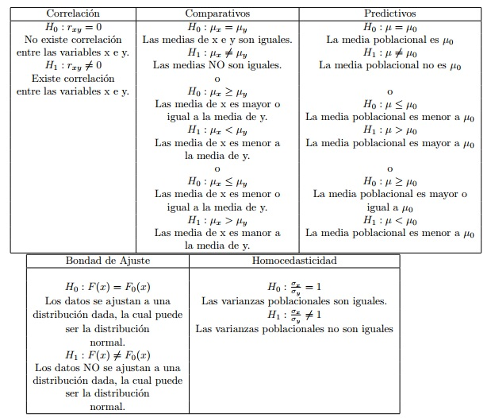
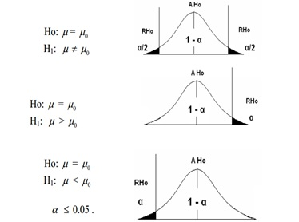
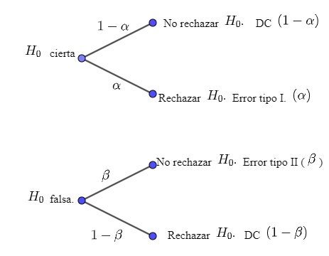
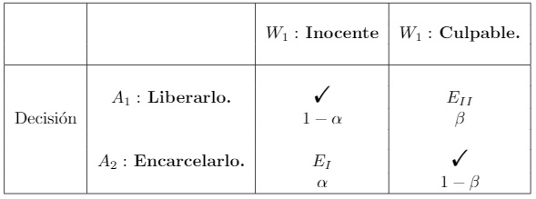
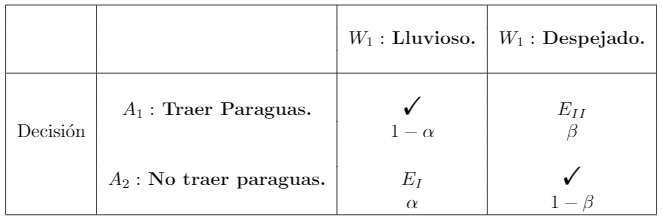
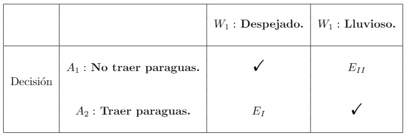
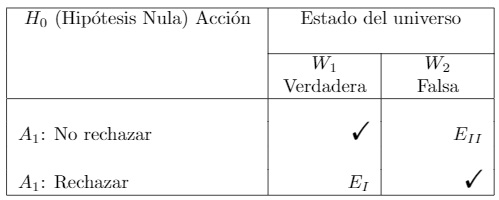

```{r setup, include=FALSE}
knitr::opts_chunk$set(echo = TRUE)
```

<center>
# Pruebas de hipótesis
</center>

## Generalidades

Cuando se realizan pruebas de hipótesis se puede hacer una analogía con un proceso judicial, como lo muestra el siguiente esquema 

En un proceso judicial
<center>
```{r,echo=FALSE, warning=FALSE, message=FALSE}
#install.packages("DiagrammeR")
library(DiagrammeR)
library(dplyr)

grViz("
      digraph Random{
      graph [layout = circo,
      overlap =T,
      outputorder = edgesfirst,
      bgcolor='white',
      splines=line]#controls l type setup
      edge[labelfontname='Arial',fontSize=30,color='red',fontcolor='navy']
      node [shape = box,style='filled',
      fillcolor='indianred4',width=1.0,
      fontSize=20,fontcolor='snow',
      fontname='Arial']#node shape
      a [label = 'Delito contra:
      
      estado,
      la colectividad,
      personas,
      patrimonio']
      b [label = 'Juez especializado:
      
      Ordinarios(civiles y de familia),
      penal, 
      penal militar,
      constitucional, 
      de paz,...']
      c [label = 'Establece la regla de decisión:
      
      Reglas de la experiencia,
      De la lógica,
      de la ciencia, 
      de la técnica']
      d [label='Recoger las pruebas:
      
      analizarlas']
      e [label='Tomar la desición 
      judicial']
      a->b[color='red']
      b->c[color='red']
      c->d[color='red']
      d->e[color='red']
      }")
```
</center>

En las pruebas de hipótesis estadísticas,


<center>
```{r,echo=FALSE, warning=FALSE, message=FALSE}
#install.packages("DiagrammeR")
library(DiagrammeR)
library(dplyr)

grViz("
      digraph Random{
      graph [layout = circo,
      overlap =T,
      outputorder = edgesfirst,
      bgcolor='white',
      splines=line]#controls l type setup
      edge[labelfontname='Arial',fontSize=30,color='red',fontcolor='navy']
      node [shape = box,style='filled',
      fillcolor='indianred4',width=1.0,
      fontSize=20,fontcolor='snow',
      fontname='Arial']#node shape
      a [label = 'Hipótesis Nula']
      b [label = 'Test de juzgamiento.']
      c [label = 'Regla de decisión,
      región crítica.']
      d [label='Datos y se calcula
      el valor del
      estadístico.']
      e [label='Rechazar o no rechazar
      la hipótesis nula.']
      a->b[color='red']
      b->c[color='red']
      c->d[color='red']
      d->e[color='red']
      }")
```
</center>


### Conceptos Básicos.

**Una hipótesis estadística:** es una  afirmación con respecto a alguna característica desconocida de una población de interés: la esencia de probar una hipótesis estadística es el decidir si la afirmación se encuentra apoyada por la evidencia experimental que se obtiene a través de una muestra aleatoria. La afirmación involucra ya sea a algún  parámetro o a alguna forma funcional no conocida de la distribución de interés a partir de la cual se obtiene una muestra aleatoria.
    
    
**Proceso de juzgamiento**proceso que termina con la decisión de rechazar o no rechazar una hipótesis con base en la información de una muestra aleatoria de una población para la cual se ha asumido un modelo probabilistico.

**Hipótesis nula** es la hipótesis que debe probarse, se le designa por el símbolo $H_{0}.$ Esta hipótesis a veces se conoce como hipótesis de no diferencia, ya que es una proposición de conformidad con (o no diferencia respecto de ) condiciones verdaderas en una población de interés.

En los juzgamientos de hipótesis se comienza con alguna teoría(hipóteis nula) y se pregunta si los datos proporcionan evidencia suficiente para rechazar la teoría. Sobre está hipótesis se estructura el proceso de juzgamiento y corresponde a $H_{0}: \theta \in \theta_{0},$ con $\theta_{0} \subset \theta.$


**Hipótesis alterna** es la hipótesis contraste de la hipótesis nula, se denota por $H_{1}$ o ($H_{a}$) y corresponde a:
$H_{1}: \theta \in \theta_{1},$ con $\theta_{1} \subset \theta.$

Donde $\theta$ es el espacio del parámetro y $\theta_{i}$ con $i= 0, 1$ es un  subconjunto del espacio del parámetro. Además $\theta_{0} \cap \theta_{1} = \phi$ y $\theta_{0} \cup \theta_{1} = \theta$

### Los elementos estructurales de una hipótesis son:

+ La(s) unidad(es) de análisis u observación.
+ Las variables implicadas en la relación.
+ Los elementos conectores o conectores lógicos.

<center>
**Ejemplo 1** 
</center>

A mayor horas de estudio de los estudiantes de Psicometría mayor será su calificación.

+ Unidad de análisis: Los estudiantes del curso de Psicometría. 

+ Variables: 
    
  Horas de estudio (Variable independiente)
    
  Calificación(Variable dependiente)
           
+ Elementos lógicos:  A mayor, mayor será

<center>
**Ejemplo 2**
</center>

Se quiere  estudiar la relación entre cierta enfermedad y la adicción al tabaco. Para realizar esto seleccionamos una muestra de 150 individuos, 100 individuos no fumadores y 50 fumadores.

+ Unidad de análisis: 100 individuos fumadores y no fumadores.
+ Variables: 
     
  Adicción al tabaco(Variable independiente)
  
  Adquirir cierta enfermedad(Variable dependiente)
  
+ Elementos lógicos:  A mayor, mayor.


### Sistema de hipótesis
La díada de hipótesis nula y alterna constituye el sistema de hipótesis del proceso de juzgamiento de la hipótesis nula, sistema que se enuncia como
\[H_{0} : \theta \in \theta_{0}\]
<center>
frente a
</center>

\[H_{1} : \theta \in \theta_{1}\]


<center>
**Ejemplo 3** 
</center>

Una línea aérea desea probar la hipótesis de que 60% de sus pasajeros desaprueba que se fume dentro de los aviones.Estableciendo las hipótesis 

\[H_{0} : p = 60%\]
<center>
frente a
</center>

\[H_{1} : p \neq 60%\]

<center>
**Ejemplo 3** 
</center>

Para una determinada carrera universitaria, históricamente los alumnos han tardado para graduarse un promedio de 7,30 años. Decimos históricamente para indicar que son datos acumulados por largo tiempo y que provienen de los registros de la facultad de años atrás. Se ha introducido un cambio en el plan de estudios de la carrera y puede creerse que con ese cambio los alumnos tardarán un tiempo distinto en graduarse. Tenemos
entonces un promedio de la población de quienes se recibieron en las anteriores condiciones (una media poblacional histórica), y queremos hacer inferencia sobre la media poblacional de los alumnos que cursan con el nuevo plan. Estos últimos no están todos accesibles, porque hay alumnos que están cursando y
otros que lo harán en el futuro, por lo que de esa población solo puedo conocer a una muestra de los que ya han egresado y ver cuánto tiempo han tardado ellos en recibirse.


Expresamos las hipótesis de este modo:

\[H_{0} : \mu = 7.30\]
<center>
frente a
</center>

\[H_{1} : \mu \neq 7.30\]


### Hipótesis simples y compuestas

Llamaremos hipótesis simples a aquellas que especifican un único valor para el parámetro (por ejemplo  $H: \mu =\mu_{0}$).

Llamaremos hipótesis compuestas a las que especifican un intervalo de valores (por ejemplo: $H: \mu =\mu_{0}$ 


<center>**Ejemplo 4**</center> 


Un ejemplo de tipo de hipótesis simple es establecer que el tiempo medio diario invertido en desplazamiento por los estudiantes de una universidad es de 45 minutos ($H: \mu = 45$). 

Un ejemplo de tipo de hipótesis compuesta es establecer que el tiempo medio diario invertido en desplazamiento por los estudiantes de una universidad es mayor a 45 minutos ($H: \mu > 45$). 


## Algoritmo para la prueba de hipótesis

Para hacer una prueba de hipótesis se deben llevar a cabo los siguientes:

1. Formulación de un problema de investigación.

2. Formulación de hipótesis de investigación.

3. Formular $H_{0}$ y $H_{1}.$


  + $H_{0} = 0$, alta probabilidad de que no hay diferencia, no hay relación, no haya causalidad. 


  + $H_{1} \not= 0$, alta probabilidad de que  haya: diferencia, relación, causalidad. 
  
4. Definir el nivel de significación $\alpha$

  
4. Determinar la estadística de prueba.  $z, t, \chi^{2}, F, ...$

<center>

</center>

5. Determinar la región crítica, ver si la prueba es unilateral izquierda, derecha, bilateral.

<center>

</center>

  Donde $AH_{0}$ es al zona de aceptación de la hipótesis nula y $RH_{0}$ es la zona de rechazo de la hipótesis nula.

6. Calcular el estadístico de prueba y comparar con el valor teórico (tabla) o el p-valor(significancia).

7. Tomar una decisión, rechazando $H_{0}$ ó aceptando $H_{0}$.
  
  Hay dos formas de hacerlo:
  
<center>
**Valor crítico**
</center>

<center>
**valor de probabilidad o valor p**
</center>

el valor de probabilidad asociado al resultado muestral, que también se llama valor p. Se trata de la
probabilidad de observar en la experiencia un resultado igual o más extremo que el obtenido a partir de los datos muestrales, bajo el supuesto de que la hipótesis nula es cierta. Es decir, la probabilidad de hallar un resultado como el que se encontró o más extremo que él, solo por azar. Un valor p pequeño indica que el resultado observado (o resultados más extremos que él) son poco probables bajo el supuesto de hipótesis nula cierta, por lo cual hay evidencia en contra de la hipótesis nula. El valor p es una probabilidad condicional a la que escribimos como(en el caso de juzgamiento de hipótesis de diferencia de medias):

<center>
$P(  |\mu| \geq \mu_{obs} | H_{0} V  )$
</center>


Donde $\mu$ es el estimador del parámetro al que se refiere la $H_{0}$. La expresión $|\mu|\geq \mu_{obs}$ es la forma reducida de decir que $\mu$ sea más extrema (por encima o por debajo) que el valor observado.

Cuanto más pequeño es el valor p, tanta más evidencia hay para rechazar $H_{0}$. Por el contrario, un valor p grande indica que el resultado observado es muy probable bajo el supuesto de hipótesis nula cierta, lo que no aporta evidencia en contra de la hipótesis nula y conduce a no rechazarla. Esta manera de indicar cuán esperable sería lo que hemos observado si H0 fuera cierta, puede vincularse con nuestro razonamiento anterior, comparando el valor p con el nivel de significación fijado de antemano.

Así resultan dos posibilidades:

Si el valor p es menor que el nivel de significación establecido
$(p<\alpha)$: se rechaza la hipótesis nula y se describe como **“un resultado estadísticamente significativo”**. Esto quiere decir que la probabilidad de haber hallado este resultado por azar es pequeña, por lo que se trata de un efecto o diferencia que muy difícilmente se puede atribuir al azar.


Si el valor p es mayor que el nivel de significación establecido $(p>\alpha)$: no se rechaza la hipótesis nula y se expresa como **“un resultado no estadísticamente significativo”**. Lo que expresa que la probabilidad de haber hallado este resultado por azar es mayor que el máximo establecido, por lo que es razonable atribuirlo al azar, es decir a la variabilidad propia de los resultados muestrales.

  
  Por ejemplo si $\alpha = 0.05$ entonces:
  
  + Si $p\leq 0.05$ se rechaza $H_{0},$ se acepta $H_{1},$ es decir se describe como “un resultado estadísticamente significativo”. Esto quiere decir que la probabilidad de haber hallado este resultado por azar es pequeña, por lo que se trata de un efecto o diferencia que muy difícilmente se puede atribuir al azar. 
  + Si $p > 0.05$ no se rechaza $H_{0},$ (se acepta $H_{0}$, se rechaza $H_{1},$) se expresa como “un resultado no estadísticamente significativo”. Lo que expresa que la probabilidad de haber hallado este resultado por azar es mayor que el máximo establecido, por lo que es razonable atribuirlo al azar, es decir a la variabilidad propia de los resultados muestrales.
  
  **Nota: Tomar la decisión de**  **NO RECHAZAR** $H_{0}$ **no significa que se tenga la certeza de que**  $\theta = \theta_{0},$
**sino que la diferencia entre**  $\theta$ y $\theta_{0}$ **es muy pequeña y por consiguiente no se detecta con los datos.** 

**En otras palabras, al**   **NO RECHAZAR** $H_{0}$ **lo único que podemos concluir es que los datos no manifiestan ningún conflicto con la afirmación de que**  $\theta = \theta_{0}.$


8. Escribir una conclusión. 


En el momento de tomar cualquier decisión  en el juzgamiento de una hipótesis estadística lleva consigo el riesgo de incurrir en una opción equivocada. Como en la analogía que se hizo al comenzar este documento, el juzgamiento de una persona en un tribunal o juzgado, es factible concluir el correspondiente proceso judicial con una decisión ajustada a las normas procesales y a la naturaleza de las pruebas, pero en realidad no acertada en cuanto a la verdad de los hechos, verdad que no siempre el juez puede conocer enteramente; por ello repetidamente se mencionan expresiones relativas a los inocentes que se encuentran purgando penas, o a los culpables que gozan de libertad plena. De manera similar a los errores en los cuales se puede incurrir en el juzgamiento de una persona, en el juzgamiento de hipótesis estadísticas se corren riesgos semejantes.

Así como un proceso judicial termina en forma normal, con la decisión de un juez o tribunal, el proceso de juzgamiento de una hipótesis nula culmina con una decisión: ya sea rechazar la hipótesis nula cuando
hay evidencia estadística para hacerlo o al no contar con dicha evidencia para rechazar la hipótesis, la de optar por no rechazarla. En este sentido, cualquiera de las decisiones puede ocasionar una equivocación
o error. Uno de ellos consiste en rechazar una hipótesis nula cuando la hipótesis es verdadera, el otro en no rechazar una hipótesis nula en el caso de ser falsa. Dichos errores se definen como:

## Tipos de Errores.

El **Error de Tipo I** es tomar una decisión errónea que consiste en rechazar la $H_{0}$ cuando esta es verdadera. Su probabilidad está fijada de antemano y es $\alpha$, el nivel de significación de la prueba.


Se llama **Error de Tipo II** a la decisión equivocada de aceptar una hipótesis nula cuando ésta es falsa.


Esto se puede  visulizar en el siguiente esquema:


<center>

</center>     


o en la siguiente tabla 


<center>

</center>

Luego :

+ P(Se cometa el error tipo I)=$\alpha$ (nivel de significación), es decir 

<center>
$\alpha =$ P(Rechazar $H_{0}|H_{0}$ es verdadera.)
</center>

+ P(NO se cometa el error tipo I)=$1 - \alpha$ (nivel de confianza) 

<center>
$1 - \alpha =$ P(No rechazar $H_{0}|H_{0}$ es verdadera.)
</center>

+ P(Se cometa el error tipo II)=$\beta$, es decir

<center>
$\beta =$ P(NO rechazar $H_{0}|H_{0}$ es falsa.)
</center>

+ P(NO se cometa el error tipo II)=$1 - \beta$  (Potencia de la prueba) 

<center>
$1 - \beta =$ P(Rechazar $H_{0}|H_{0}$ es falsa.) **esto se llama potencia**
</center>


<center>
**Ejemplos de juzgamiento de hipótesis y error de tipo I y error de tipo II.**
</center>


<center>
Ejemplo 1.
</center>


En la analogía con un proceso judicial

<center>

</center>


+ Si lo liberan y es inocente: acertó el juez
+ Si lo liberan y es culpable: error


+ Si lo encarcelan y es inocente: error
+ Si lo encarcelan y es culpable: acertó el juez


<center>
Ejemplo 2.
</center>

<center>

</center>


+ Si traigo paraguas y llueve: acerté
+ Si traigo paraguas y no llueve: error

+ Si no traigo paraguas y llueve: error
+ Si no traigo paraguas y no llueve: acerté

<center>
Ejemplo 3.
</center>


<center>

</center>

+  Si no traigo paraguas y no llueve: acerté
+  Si no traigo paraguas y llueve: error
+  Si traigo paraguas y no llueve: error
+  Si traigo paraguas y llueve: acerté


De manera general se tiene


<center>

</center>


Un resultado es **significativo** cuando conduce a rechazar  $H_{0}$ a un determinado nivel de significación.


