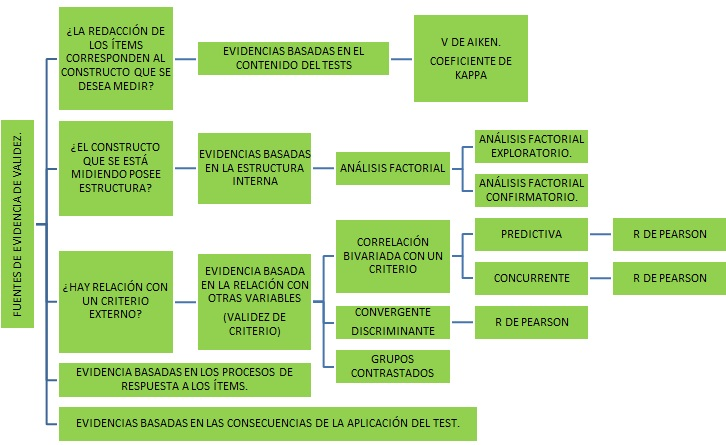
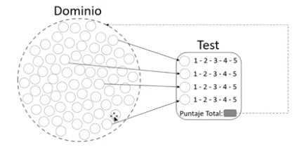
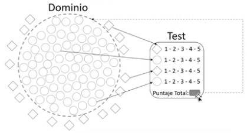
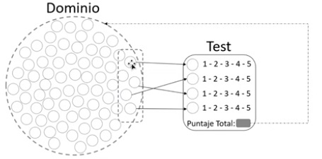
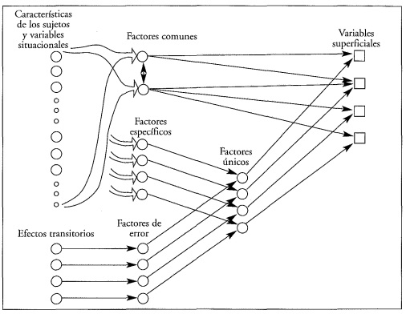
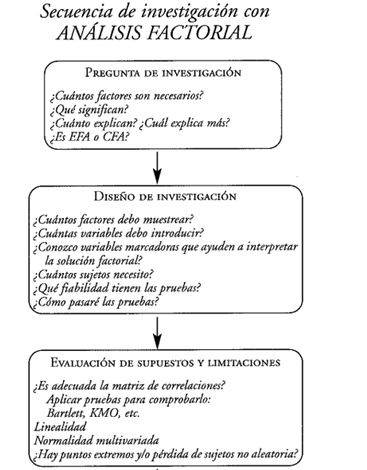
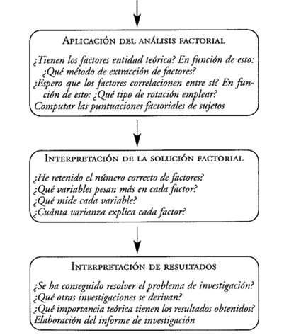

## Validez.

**La prueba mide lo que decimos que mide**

## Validez

## Evidencia de validez.

Dominio de comportamiento: Responsabilidad, depresión, estrés o cualquier otro constructo psicológico.

## Evidencia de validez.

Supongamos que se quiere saber si una persona está estresada.
El estrés involucra un monton de comportamientos y cuando se elabora una prueba no se puede evaluar todos los comportamientos que están asociados al estrés, entonces se selecciona una muestra de comportamientos y se solicita alas personas empleando un método estandarizado, es decir que todas las personas usen la misma metodología para evaluar con que frecuencia experimenta algunos de estos sintomas:

+ Problemas de concentración.
+ Sentirse tensionado.
+ Dificultad para dormir.
+ Sentirse irritable.
+ Incapacidad para relajarse.

## Evidencia de validez.

Cuando se quiere evaluar cualquier tipo de dominio o cualquier tipo de constructo que sea de interés para poder hacerlo en forma válida tengo que garantizar varias cosas:

1. **Tener cuidado al elegir una muestra que no es representativa del dominio.** 

Por ejemplo tener pensamientos negativos no es algo que es solo vinculado al estrés, también puede ser sintoma de depresión por ejemplo.

## Evidencia de validez.

## Evidencia de validez.

2. **Hacer una subrepresentación del constructo** es decir supongamos que hay un dominio que involucra muchos comportamientos, pero lo que se hace es elegir una parte muy restringida de ese dominio.

Si es una prueba de inteligencia y solo preguntar si solo sabe resolver ejercicios matemáticos.

## Evidencia de validez.

¿Como hacer para garantizar efectivamente que esa muestra es una muestra representativa del dominio que se quiere evaluar?

Las distintas fuentes de  evidencias de validez están basadas en:

1. Evidencias basadas en el contenido del test.
2. Evidencias basadas en los procesos de respuesta a los ítems.
3. Evidencias basada en la estructura interna.
4. Evidencia basada en la relación con otras variables.
5. Evidencias basadas en las consecuencias de la aplicación del test.

## Evidencia de validez de contenido.

Grado en el cual el contenido de una prueba es congruente con los fines de la prueba.

Se debe tener en cuenta:

+ Definición del dominio.
+ Representación del dominio.
+ Relevancia del dominio.
+ Apropiación del proceso de desarrollo de pruebas.

## Evidencia de validez de contenido.

**Se deben tener en cuenta dos tipos de análisis**

I. Evaluar las relaciones entre el constructo y el contenido del test:

+ Definición del dominio: Especificaciones de prueba
+ Representación que todas las posibles conductas estén recogidas en el test (nada falta).
+ Relevancia: Exhaustiva especificación de todas las posibles conductas o dominios del constructo a   medir (nada sobra).

## Evidencia de validez de contenido.

**Valorar los factores contextuales internos y externos que puedan añadir varianza no deseada.**

El formato de los ítems, el tipo de tareas exigidas, y la evaluación de la propia situación de test. Se incluyen las instrucciones para la administración y corrección de la prueba, la interacción entre examinador-examinado, la familiaridad con la situación, las diferencias de motivación o ansiedad o el tipo de material utilizado.

## Evidencia de validez de contenido.

**Proceso de validación de contenido:**

+ **Se debe definir el dominio del constructo y las dimensiones asociadas**

Se tiene que decir teóricamente a que se hace referencia cuando se habla por ejemplo de ansiedad ante alguna situación.Supongamos que se dice que la ansiedad ante examenes hace referencia a un tipo de reacción emocionalque aparece en situaciones de evaluación y que esa reacción emocional tiene componentes: cognitivos, conductuales y fisiológicos. Entonces a partir de esa teória se define ese dominio y se comienza a redactar los ítems que de alguna manera deben reflejar ese dominio que se quiere medir.

## Evidencia de validez de contenido.

**Proceso de validación de contenido:**

+ **Elaborar el dominio y objetivos que va a cubrir el test.**

## Evidencia de validez de contenido.

**Proceso de validación de contenido:**

+ **Selección de un panel de expertos en el dominio.** una vez se redacte el conjunto inicial de ítems, se identifica expertos en ese campo teórico.Se envia el conjunto de ítems a diferentes jueces y se les pide de forma independiente como valoran cada uno de esos ítems, de acuerdo a la pertinencia, claridad y redacción.  Esa valoración puntua en la medida que siente que ese items es representativo de ese dominio, y posteriormente juntar esa información de los jueces y por medio de un coeficiente: **Kappa** o **V de Aiken** ver en promedio como cada juez valoro cada uno de esos ítems y hacer una limpieza de ítems de acuerdo a los que hayan sido mejor valorados por los jueces.

## Evidencia de validez de contenido.

**Proceso de validación de contenido:**

La forma de calcular el coeficiente V de Aiken en excel está en el siguiente enlace:

(https://www.youtube.com/watch?v=HzHrVUmztyg)

## Evidencia de validez de contenido.

**Proceso de validación de contenido:**

+ **Establecer un marco estructurado para medir el grado de acuerdo entre los distintos jueces.**

## Evidencia relacionada con la estructura interna: análisis factorial.

Es una técnica que permite  evaluar si las relaciones entre los ítems y/o las dimensiones confirman la existencia de los constructos que el test pretende medir. Es un método de reducción de datos cuyo objetivo es reducir un conjunto de variables observadas a un conjunto menor de variables no observadas.

Es un modelo estadístico que análiza patrones de relación entre una cantidad de variables y permite identificar como se agrupan una serie de reactivos, estas relaciones pueden explicarse a partir de una serie de variables no observables(latentes) denominadas factores cuyo número debe ser menor que el de variables.

## Evidencia relacionada con la estructura interna: análisis factorial.

Ejemplos:

+ La comprensión lectora es una variable latente, cuyas variables observadas son: semántica,   sintáctica y pragmática.

+ Ansiedad ante examenes es una variable latente, cuyas variables observadas son: síntomas cognitivos, síntomas fisiológicos y síntomas conductuales.
   

## Evidencia relacionada con la estructura interna: análisis factorial.

El análisis factorial es un método que intenta explicar un conjunto grande de variables observadas mediante un número reducido de variables hipotéticas llamadas factores. Este método está basado en la covariación entre variables, dicha coavriación implica dos cosas:

+ Que tienen algo en común **COMUNALIDAD**

+ Que tienen algo específico  **ESPECIFICIDAD** 

Entonces en el análisis factorial lo que se busca es si existe una comunalidad entre un conjunto de ítems.

## Evidencia relacionada con la estructura interna: análisis factorial.
La puntuación de cualquier sujeto en una variable superficial es una suma de influencias de factores comunes, de un factor específico y de un factor de error de medida, o de factores comunes y de un factor único. Podemos expresar esto de manera formal como:

$X_{ij} = F_{1i}a_{i1} + F_{2i}a_{i2} + F_{3i}a_{i3} + . . . + F_{ni}a_{in} + U_{i}$

Donde:

+ $X_{ij}$ es la puntuación del sujeto i en la variable j.
+ Los F son los coeficientes o cargas factoriales correspondientes a los n diferentes factores comunes.
+ Las a son las puntuaciones del sujeto en cada factor y U es el factor únicos.

## Evidencia relacionada con la estructura interna: análisis factorial.

La teória completa de los factores comunes.

## Evidencia relacionada con la estructura interna: tipos de análisis factorial.

**Análisis factorial exploratorio:** no se tiene hipótesis a priori sobre cuales pueden ser los factores que influyan en las variables medidas. Se suele llevar  a cabo en las etapas iniciales de un proceso de investigación y así se identifican factores que pueden contrastarse luego con un análisis confirmatorio. Se busca los factores(número) comunes(variables latentes) necesarios para explicar la varianza común del conjunto de ítems analizado. Soló se puede determinar el número de factores que se espera, pero no su composición ni las relaciones que cada uno de los factores mantiene con el resto.

## Evidencia relacionada con la estructura interna: tipos de análisis factorial.

**Análisis factorial confirmatorio:** se cuenta con una hipótesis sobre la dimensionalidad del instrumento, en el número de dimensioneso factores y en la relación entre los ítems y el factor, y de los factores entre sí. Este método permite al investigador definir cuantos factores espera, que factores están relacionados entre sí, y que ítems están relacionados con cada factor.

## Secuencia de investigación con AF.

## Secuencia de investigación con AF.

## Análisis factorial: matriz de correlación.

El primer paso del AF consiste en la obtención de una matriz que contiene las correlaciones entre todos los pares de variables observables medidas. Está matriz muestra el nivel crítico unilateral (sig. unilateral) asociada a cada coeficiente de correlación, si p-valor < 0,05 se rechaza la hipótesis nula, indicando que la correlación poblacional entre el par de variables puede ser mirado de una manera significativamente distinta de cero.

Si se encuentran muchos niveles críticos pequeños sería lo ideal. Por otro lado si el determinante se aproxima a 0 muestra que las variables están linealmente relacionadas.

## Análisis factorial: evaluación de supuestos.

¿ Es adecuado un modelo factorial?

Hay varias pruebas utilizables en este sentido: el determinante de la matriz, el test de esfericidad de Bardett, la prueba de Kaiser-Meyer-Olkin.

**Índice de Kaiser-Meyer-Olkin:** es un coeficiente de correlación parcial que mide la correlación que existe entre dos variables cuando se han excluido los efectos lineales de otras variables.

+ Si KMO < 0,5 el AF no es acetable.
+ si $0,70\leq KMO \leq 0.79$ suficiente.
+ Si $0.8\leq KMO$ satisfactoria.

## Análisis factorial: evaluación de supuestos.

**La prueba de Bartlett:**  está diseñada para contrastar la hipó tesis de que los elementos de fuera de la diagonal positiva (las correlaciones) de la matriz de correlaciones son cero (los diagonales son siempre 1). Una matriz que cumple esta propiedad se denomina matriz identidad.

Si p-valor <0.05 se rechaza la hipótesis nula de esfericidad, luego el modelo factorial es adecuado para explicar los datos.

## Aplicación del análisis factorial: métodos de extracción de las variables.

+ Componentes principales.
+ Ejes principales.
+ Mínimos cuadrados no ponderados.
+ Mínimos cuadrados generalizados.
+ Máxima verosimilitud.
+ Análisis alfa.
+ Análisis de imagen.

##  Métodos de extracción de las variables: componentes principales.

Está técnica busca transformar un conjunto de variables intercorrelacionadas en un conjunto de agrupaciones empiricas de variables no correlacionadas llamadas factores. 

Si lo que se busca es conocer el número y composición de componentes para resumir las puntuaciones observadas en un conjunto grande de variables empiricas(observadas) entonces lo apropiado es un análisis de componentes principales.

Esté método explica el máximo porcentaje de varianza observada en cada ítem a partir de un númeromenor de componentes que resuma esa información.

##  Métodos de extracción de las variables: componentes principales.

Está técnica considera dosvariables por lo que tienen en común, están relacionadas por su comunalidad, por lo tanto debe existir una serie de correlaciones comunes que se tendrán que localizar,en este caso además del componente común se tiene una parte específica  que no está relacionada con los demás, siendo explicada por factores específicos o únicos.

Lo que se busca es conseguir la mejor estimación posible de las comunalidades a partir del número de factores retenidos.

##  Métodos de extracción de las variables: mínimos cuadrados no ponderados.

Genera una matriz de pesos factoriales que minimiza la suma de los cuadrados de las diferencias entre las matrices de correlaciones observada y reproducida, ignorando los elementos de la diagonal. 

##  Rotación de factores.

Métodos para realizar rotaciones factoriales se divide en dos grandes grupos:

**Métodos ortogonales**, en el cual no existe relación entre los factores.

+ Varimax.
+ Quartimax.
+ Equamax.

**Método Oblicuo** considera que dos factores pueden explicar una misma realidad, es decir que existe correación entre los factores. 

+ Oblimin directo.
+ Promax.
+ Cargas factoriales.

##  Rotación de factores.

Métodos para realizar rotaciones factoriales se divide en dos grandes grupos:

**Método Oblicuo** considera que dos factores pueden explicar una misma realidad, es decir que existe correación entre los factores. 

+ Oblimin directo.
+ Promax.
+ Cargas factoriales.

## Cargas factoriales.

La recomendación es nunca tomar la saturación por debajo de 0.40, más aún cuando la muestra es menor de 300 casos.

Clasificación de las correlaciones variable factor, indicando hasta que punto es adecuada la saturación de una variable en un factor.

+ 0.71- 5.0 excelente
+ 0.63 - 4.0 muy buena
+ 0.55 - 3.0 buena
+ 0.45 - 2.0 regular
+ 0.32-1.0 pobre

