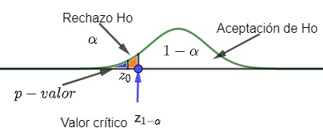

```{r setup, include=FALSE}
knitr::opts_chunk$set(echo = FALSE)
```
## Juzgamiento o prueba de hipótesis.


Consiste en una metodología paso a paso que nos permitirá hacer inferencias con respecto al valor específico de un parámetro de la población mediante el análisis de diferencias entre los resultados que observamos de la realidad (obtenidos de la muestra) y los resultados que esperariamos obtener si alguna hipótesis subyacente fuera verdadera.

Constituye una técnica provechosa para analizar diferencias y tomar decisiones.

## Juzgamiento o prueba de hipótesis.

Se parte de algún tipo de distribución. Por ejemplo:
 
 
 + Uniforme: todos los eventos son igualmente probables.
 
 + Normal: No todos los eventos son  igualmente probables. Ejemplos: altura, peso, inteligencia, extroversión, rendimiento académico, tiempo en que duran los estudiantes en prepararsen para un examen, ...
 
 


## Distribución normal.

<center>


</center>


## Aproximación a una distribución normal.

Siempre que un conjunto de datos se distribuya de manera aproximada a una distribución normal se pueden analizar teniendo en cuenta las propiedades de dicha distribución.

+

<center>
  
</center>

+

<center>
  
</center>

## Ejemplo de un  juzgamiento de hipótesis.
Supongamos que el tiempo necesario para prepararse para un examen es de 8 horas. Un grupo de cientificos diseñan una píldora para disminuir el tiempo necesario para prepararse para dicho examen.

Se toma una muestra de tres estudiantes a los cuales se les suministra voluntariamente dicha píldora, los cuales preparan el examen en solo 6 horas.

**¿FUNCIONA O NO FUNCIONA LA PÍLDORA?**

Con lo visto en la muestra parece funcionar.

Pero <span style="color:red"> CUIDADO! </span>

Ya que si el tiempo necesario para preparar el examen se distribuía de manera normal, existe la probabilidad de que las tres personas que seleccione en la muestra se ubicaban en la cola inferior, es decir sin tomar dicha píldora iban a gastar ese tiempo.

En otras palabras **la píldora no funciona solo que hubo un error de muestreo**

## Ilustración de la situación.

<center>
   
</center>

## Comparación con la distribución normal

Conociendo el área dela cola izquierda, puedo conocer la probabilidad de que justo elija al azar personas que se encuentren de 6 horas para abajo.

<center>

</center>

## Comparación con la distribución normal

Existe la probabilidad de 2.15% de que justo elija alguien de que estaba por abajo de 6 horas.


Entonces se dice que la píldora  funciona con un margen de error del 2.15%.


En función de lo anterior siempre se debe hablar del margen de error, al decir que la píldora funciona o no funciona. Para este caso la píldora funciona con un error del 2.15%.


La situación anterior se puede dar en:

+ Tratamiento psicológico.

+ Método para aumentar la motivación.

+ Método de estudio para aprender más rápido.

+ Método para disminuir la ansiedad.

+ ...


## ¿Que se debe hacer al analizar los resultados?

En el momento de analizar los resultados en algún tratamiento siempre se deben comparar con los resultados que uno esperaría simplemente por azar.

Siempre se debe dudar y mirar los errores.

Entonces surgen las preguntas:

+ ¿Cuando se considera que los resultados se deben al azar?

+ ¿Cuando se considera que los  resultados no se deben al azar?

<center>
<span style="color:red"> Veamos! </span>
</center>

## Hablemos de juzgamiento o pruebas de hipótesis.


Las pruebas de hipótesis dependen entre otras cosas de dos aspectos importantes:

+ Resultados de las muestras.

+ Resultados esperados si una hipótesis determinada fuera cierta.


**Y el  objetivo de las pruebas de hipótesis es examinar los resultados que se obtienen  en un estudio  y evaluar cual es la probabilidad de que esos resultados que se estan obteniendo hayan sido simplemente por azar.**

Ya que se deben dar situaciones como la siguiente:

Un estudiante le pide a un profesor que piense un número del 1 al 10. El profesor responde 8.

<center>
<span style="color:red"> Acerto! es un mago! sabe leer la mente! </span>
</center>


No necesariamente es un mago o lee la mente de las personas, solo acerto por azar. 

## 

La prueba de hipótesis analiza si la proporción de exitos que obtuvo el profesor luego de que 100 estudiantes  pensaron un número y le preguntaron al profesor. ¿ Se podría haber obtenido simplemente por azar?

+ Si acerto 10 veces(10%) es probable que haya sido por azar.

+ Si acerto 97 veces(97%) es poco probable que haya acertado solamente por azar.


**En una prueba de hipótesis se debe ver si los resultados son cercanos o no a lo que se obtendría por azar y en función de eso  se inclina a favor o en contra de una hipótesis (TIENE PODERES MÁGICOS!).**


Por lo tanto se debe hablar de hipótesis estadística y los pasos de verificación de la misma.


## Hipótesis estadística y pasos para verificación de una hipótesis.


**Hipótesis estadística** Acontecimiento futuro, escenario futuro que se desconoce pero que se predice y de acuerdo a lo que se obtiene se va a tener evidencia o favor o en contra.

<center>
**Pasos para la verificacion de una hipótesis.**
</center>

+ Todos los resultados posibles del experimento se deben haber anticipado con aterioridad a la verificación.

+ Antes de proceder a la verificación se ha acordado el modo operacional y la variable en cuestión.

+ Se ha determinado cuales serán los resultados que implicaran el descarte o la confirmación de la hipótesis. 

+ Se efectúa el experimento y en función de los resultados se decide si la hipótesis se descarta o se confirma.


## Conceptos centrales de una prueba de hipótesis.

+ Hipotesis nula $H_{0}$

+ Hipótesis alternativa $H_{1}$

+ Valor crítico

+ Región de aceptación y rechazo.

+ Error tipo I.

+ Error tipo II.

+ Confianza y potencia.


## Veamos estos conceptos con un ejemplo.

Supongamos que se quiere implementar una nueva *terapia psicológica* (técnica de relajación, programa de entrenamiento) y se quiere demostrar que funciona. Por ejemplo los estudiantes que la reciben tienen menor nivel de ansiedad que aquellos que no la reciben.

Entonces la pregunta de investigación será:

**¿El programa "Enciende la vela" sirve para reducir la ansiedad antes del examen?**

Y las hipótesis


**Hipótesis Nula ** $H_{0}:$El programa "Enciende la vela" **NO** sirve para reducir la ansiedad antes del examen. Los resultados que se van a observar son simplemente producto del azar.


**Hipótesis Alternativa ** $H_{1}:$El programa "Enciende la vela"  sirve para reducir la ansiedad antes del examen. Los resultados que se van a observar son lo suficientemente alejados de lo que uno esperaria obtener por azar.

##

Supongamos que se aplico  un test de ansiedad antes de un examen donde se le solicito a los participantes responder los siguientes ítems:

+ Siente palpitaciones.

+ Te bloqueas.

+ Siente ganas de no presentarse al examen.

+ Piensa que no va aprobar.

puntuando de las siguente forma: 

+ 0= casi nunca,

+ 1= pocas veces,

+ 2= unas veces, si otras veces no

+ 3= muchas veces

+ 4= casi siempre


##


En donde el nivel de ansiedad presento una distribución normal con media 15 puntos ($\overline{X} = 15$)y desviación estandar 3 puntos  ($s = 3$), lo cual se obtuvo calculando el puntaje total luego de aplicar dicho test.

<center>

</center>

En torno a 15 esta la mayor parte de los estudiantes.


##

Si se eligen 10 estudiantes al azar y les pido que tomen el programa “Enciende la vela” es muy poco probable(probabilidad de 2.15%) que obtengan valores inferiores a 9(antes de programa),  por lo tanto ese punto se establece como crítico:

+ Si los valores(media) de la puntuación luego de tomar dicho programa estan por debajo de ese valor crítico(9) entonces rechazo la hipótesis nula. **Los resultados observados son lo suficientemente alejados de lo que uno esperaria obtener por azar.**

+ Si los niveles de ansiedad(media) son de 12 por ejemplo no se alcaza a superar ese valor crítico(9) es decir esta dentro de los valores que se esperaria obtener por azar lo que se hace es aceptar la hipotesis nula. Entonces el programa no esta funcionando mejor que el azar y por lo tanto se debe revisar dicho tratamiento.

## Hipotesis nula y alternativa.

las pruebas de hipotesis se inician con una teória previa o afirmación sobre un parámetro.

**Hipótesis Nula ** $H_{0}$ sugiere la  no diferencia y es considerada válida hasta que se demuestre lo contrario.

Siempre contiene un signo de igualdad con respecto a un parámetro.

**Hipótesis Alternativa ** $H_{1}$ se opone a la hipótesis nula, se puede considerar aceptable en caso de rechazar la hipótesis nula.

Contiene el signo de desigualdad con respecto al valor del parámetro especificado.


##

En otras palabras cuando planteamos que queremos evaluar la eficacia de un tratamiento en este caso para reducir la ansiedad ante examenes. Lo que se  va a plantear es que los resultados que se van a obtener a partir de ese tratamiento se alejan de lo que uno esperaría obtener por azar.

Entonces si los resultados que se obtienen no se alejan sino que son bastante cercanos de lo que uno esperaria obtener por azar, eso significa que nos inclinariamos a favor de la hipótesis nula, lo que sugiere que no hay diferencia entre los grupos y que no hay diferencia entre lo que estamos obteniendo y lo que se esperaria obtener por azar. Teniendo en cuenta lo anterior planteariamos la hipotesis nula.

La hipótesis alternativa plantea que si hay diferencia entre lo que se está observando y lo que se esperaría obtener por azar y se representa como $H_{1} \not=.$ Se puede decir que hay evidencia a favor de $H_{1}$ cuando se rechaza la hipótesis nula.

Prácticamente no operamos con la hipótesis alternativa sino que nos centramos en la hipótesis nula.

## Resumiendo

Básicamente lo que se está testeando es si los resultados que se estan obteniendo de este experimento o de este estudio se asemejan o no a lo que uno esperaria obtener por azar:

+ Si se asemejan entonces aceptamos $H_{0},$ es verdad que se asemejan al azar por ende el tratamiento no está funcionando o no funciono mejor que el azar.

+ Si hay diferencia rechazamos la hipótesis nula y podemos inclinarnos por la hipótesis alterna que dice que el tratamiento si funciona mejor que el azar, pero ojo no se testea $H_{1}$ directamente sino que se trabaja solamente con la $H_{0}.$

## Valor crítico

Cuando se trabaja con estimación de parametros sabemos que hay resultados que se obtienen por azar.

Veamos la siguiente situación:

<center>


</center>


<center>
<span style="color:red"> ¿Poderes Mágicos? </span>
</center>

Se hace el experimento 200 veces; adivinar la mano donde esta la moneda. Se tienen la siguientes situaciones.

+ 100(50%) veces acerto.(Lo que se espera por azar)

+  120 veces acerto.(Muy cerca de lo que se espera por azar)


Entonces se debe definir un valor crítico de tal forma que si se supera ese valor crítico de aciertos entonces nos inclinamos a que se tienen poderes mágicos( Rechazo $H_{0}$), pero sino supero ese valor crítico nos inclinamos en la región de aceptación de la hipótesis nula es decir que es lo que se esperaria por azar.(No se tienen poderes mágicos)


## ¿Como fijar ese valor crítico?


Para fijar ese valor crítico hacemos uso de las distribuciones de probabilidad.

En una prueba de hipótesis podemos dividir la distribucion de muestreo en dos partes:

+ **Región de rechazo** si el estadístico cae en esta región se rechaza $H_{0}.$

+ **Región de NO rechazo**(Aceptación) si el estadístico cae en esta región NO se rechaza $H_{0}.$(Acepta $H_{0}$)

En la distribución normal, se conocen las áreas correspondientes, es decir se conoce la probabilidad de obtener cada valor por azar.

<center>


</center>


##
Hay un valor que se suele fijar que es de 1.96 de puntaje z (normal estándar) que significa que está a 1,96 desviaciones estándar con respecto a la media. Por abajo y arriba de casi dos desviaciones estándar está solamente el 5% del área. Esto significa que si yo eligiera un valor al azar hay un 95% de probabilidad que ese valor venga de la región de aceptación y solo un 5% de probabilidad de que ese valor que yo elijo al azar provenga de esos valores extremos(zona de rechazo), como es tan baja la probabilidad de que se elija un valor que este por fuera de ese valor crítico entonces se plantea que está es la zona de rechazo de la hipótesis nula; es decir si se obtiene un valor suficientemente alejado de un valor que se puede obtener por azar entonces rechazo la hipótesis nula.

Por otro lado si se obtiene un valor(del estadístico) del valor crítico hacia la media o de la media hacia el valor crítico es la denominada zona de aceptación de la hipótesis nula. El valor que se obtiene no es exactamente el valor esperado pero es un valor muy cercano  a lo que se esperaría obtener por azar, si bien no es lo suficientemente extremo para rechazar $H_{0}$, lo que se hace es no rechazar $H_{0}$ es decir acepto la $H_{0}.$


## Para el ejemplo de ansiedad.

Si el valor promedio de ansiedad es 15 y supongamos que se ponen en función de las desviaciones estándar, se hace 1,96 desviaciones estandar por debajo(1,96$\sigma$=1,96(3)=9,12) entonces se hace que ese valor(9,12) sea el valor crítico y en función de ese valor crítico se establece la zona de rechazo y la zona de aceptación.


<center>

</center>

##

Entonces si despues de tomar el El programa de entrenamiento “Enciende la vela” los estudiantes obtienen niveles de ansiedad por debajo de 9.12 es decir que supera ese valor crítico entonces rechazo $H_{0}.$ Es decir que dicho tratamiento no es lo mismo que el azar es decir que genera una diferencia significativa con respecto al azar.

Por el contrario si al llevar a cabo dicho tratamiento se observa que los estudiantes tienen valores de ansiedad que no superan ese valor crítico, supongamos 12,3 entonces no rechazo la hipótesis(Acepto $H_{0}$) es decir que el tratamiento no es mejor que el azar.

## Error tipo I.

Supongamos que se tomo una muestra aleatoria se aplico el tratamiento y se obtuvo un valor de 8 entonces se rechaza $H_{0},$ sin embargo existe la probabilidad de que ese grupito de estudiantes que se eligio para hacer el estudio eran estudiantes que de todos modos iban a tomar valores bajos si esto ocurre estamos en la presencia de un **error tipo I Rechazar** $H_{0}$ **siendo cierta.**  


<center>

</center>

Es decir el tratamiento no funcionaba no bajaba la ansiedad, pero justo por casualidad se eligio una muestra de esos 10 estudiantes que tenian baja ansiedad y por eso estamos obteniendo resultados tan bajos, pero no es porque el tratamiento funciona en realidad el tratamiento no genera efectos distintos del azar. En relidad $H_{0}$ es cierta pero se rechaza por un capricho del azar justo se eligio personas que ya iban a tener niveles de ansiedad.

**La probabilidad de cometer un error tipo I, se suele llamar significancia de la prueba y se denota como** $\alpha.$

## Error tipo II.

**Aceptar la $H_{0}$ cuando en realidad es falsa, debería rechazarla.**

El tratamiento si funciona, es decir se aplica el tratamiento a un grupo de estudiantes pero por determinado factor:

+ Muestra pequeña.

+ El tratamiento funciona pero no es lo suficientemente fuerte.

+ Por diversos factores no se alcanza a superar  ese valor crítico.

Supongamos que el valor crítico es 9 y luego del tratamiento su nivel de ansiedad es 10, como no supera el valor crítico, no rechazo $H_{0}$ sino que la acepto y digo el tratamiento no funciona y puede ser que en realidad este ocurriendo un error tipo II, es decir **el tratamiento funciona pero no alcanzo a ese valor crítico.**

##

Lo bueno es que el error tipo I, se puede cuantificar porque depende del valor crítico, es decir de acuerdo a donde  se fije el valor crítico se obtiene el error tipo I.

En el caso de nuestro valor crítico de 9, la probabilidad del error tipo I era del 5%, es decir rechazo $H_{0},$ con un margen de error del 5%.

Esto significa que el **NIVEL DE CONFIANZA ES DEL 95%**,  esto significa que con un 95% de probabilidad no son resultados que uno esperaria obtener por azar, si elijo un valor por azar el 95% de las veces va venir de la zona de aceptación, y solamente un 5% de la veces va venir de los extremos.   


## Error Tipo I y Error Tipo II.

<center>

</center>


## ¿Que pasa si se mueve el valor crítico?


<center>

</center>

Si el valor crítico se vuelve mas pequeño, es decir si se disminuye la probabilidad del error tipo I ($\alpha$),   se tiene mayor riesgo de cometer un error de tipo II.

## Valor de probabilidad o valor p.

El valor de probabilidad asociado al resultado muestral, que también se llama valor p. Se trata de la probabilidad de observar en la experiencia un resultado igual o más extremo que el obtenido a partir de los datos muestrales, bajo el supuesto de que la hipótesis nula es cierta. Es decir, la probabilidad de hallar un resultado como el que se encontró o más extremo que él, solo por azar. Un valor p pequeño indica que el resultado observado (o resultados más extremos que él) son poco probables bajo el supuesto de hipótesis nula cierta, por lo cual hay evidencia en contra de la hipótesis nula.

Cuanto más pequeño es el valor p, tanta más evidencia hay para rechazar $H_{0}$. Por el contrario, un valor p grande indica que el resultado observado es muy probable bajo el supuesto de hipótesis nula cierta, lo que no aporta evidencia en contra de la hipótesis nula y conduce a no rechazarla. Esta manera de indicar cuán esperable sería lo que hemos observado si H0 fuera cierta, puede vincularse con nuestro razonamiento anterior, comparando el valor p con el nivel de significación fijado de antemano.

Así resultan dos posibilidades: 

Si el valor p es menor que el nivel de significación establecido
$(p<\alpha)$: se rechaza la hipótesis nula y se describe como **“un resultado estadísticamente significativo”**. Esto quiere decir que la probabilidad de haber hallado este resultado por azar es pequeña, por lo que se trata de un efecto o diferencia que muy difícilmente se puede atribuir al azar.


Si el valor p es mayor que el nivel de significación establecido $(p>\alpha)$: no se rechaza la hipótesis nula y se expresa como **“un resultado no estadísticamente significativo”**. Lo que expresa que la probabilidad de haber hallado este resultado por azar es mayor que el máximo establecido, por lo que es razonable atribuirlo al azar, es decir a la variabilidad propia de los resultados muestrales.


##

<center>
 
</center>

Donde $z_{0}$ es el valor del estadístico calculado teniendo en cuenta la muestra. Observamos que:

+ En la segunda gráfica p-valor $> \alpha$, por lo tanto no se rechaza $H_{0},$ (se acepta $H_{0}$, se rechaza $H_{1},$) se expresa como “un resultado no estadísticamente significativo”. Lo que expresa que la probabilidad de haber hallado este resultado por azar es mayor que el máximo establecido, por lo que es razonable atribuirlo al azar, es decir a la variabilidad propia de los resultados muestrales.

+ En la tercera gráfica p-valor $< \alpha$, se rechaza $H_{0},$ se acepta $H_{1},$ es decir se describe como “un resultado estadísticamente significativo”. Esto quiere decir que la probabilidad de haber hallado este resultado por azar es pequeña, por lo que se trata de un efecto o diferencia que muy difícilmente se puede atribuir al azar.

**El valor p está indicando cual es la probabilidad de que esos resultados que se estan obteniendo (de la muestra) se deban al azar.**

## 

Intuitivamente, es el nivel de credibilidad de la hipótesis nula, el cual depende de $\alpha.$ De manera formal es la probabilidad de obtener una discrepancia(ir al contrario) mayor o igual a la encontrada en la muestra cuando $H_{0}$ es cierta.

El p-valor tambien se llama significación(significancia) del contraste. ** No se debe confundir con el nivel de significación(significancia) $\alpha$ del contraste.**

En los siguientes artículos se puede ver la aplicación.


Artículo 1.

<center>
**Depresión, ansiedad e ira en adultos que sufrieron ataque  al miocardio: un estudio de  caso-control**
</center>


Artículo 2.
<center>
**Effectiveness of a training program to decrease cognitive manifestations of anxiety in college freshmen before academic exams**
</center>


## Para resumir

<center>

</center>

Luego :

+ P(Se cometa el error tipo I)=$\alpha$ (nivel de significación), es decir 

<center>
$\alpha =$ P(Rechazar $H_{0}|H_{0}$ es verdadera.)
</center>

+ P(NO se cometa el error tipo I)=$1 - \alpha$ (nivel de confianza) 

<center>
$1 - \alpha =$ P(No rechazar $H_{0}|H_{0}$ es verdadera.)
</center>

+ P(Se cometa el error tipo II)=$\beta$, es decir

<center>
$\beta =$ P(NO rechazar $H_{0}|H_{0}$ es falsa.)
</center>

+ P(NO se cometa el error tipo II)=$1 - \beta$  (Potencia de la prueba) 

<center>
$1 - \beta =$ P(Rechazar $H_{0}|H_{0}$ es falsa.) **esto se llama potencia**
</center>


## ¿Que es la potencia estadística?

Supongamos que se esta desarrollando un tratamiento(programa) para disminuir la ansiedad ante examenes o un protocolo para que los estudiantes puedan preparse en menos horas de estudio para un examen o un tratamiento para bajar de peso, etc.

Supongase que se forman dos grupos: un grupo control y el otro a quien se le administrará el tratamiento.

<center>

</center>

La intensión es análizar como se comportan las medias si se asemejan bastante esta muy cerca la una de la otra y cuando se aplica una prueba de hipótesis, por ejemplo una prueba t para comparar grupos,  lo que arroja esa prueba de hipótesis es un valor p son superior a 0.05 (por ejemplo 0.27) y por lo tanto se aceptaria la hipótesis nula.


## 

**Quiere decir que hay una probabilidad elevada de que esas leves diferencias que se observan entre los grupos se deban simplemente al azar**

En otras palabras esas diferencias no  hacen que el grupo que recibe tratamiento tenga una media más baja porque el tratamiento es eficaz sino que estas diferencias se podrían explicar simplemente por azar, entonces como el valor p que se obtiene supera la probabilidad del punto de corte de 0.05 se acepta $H_{0}.$

Es decir inclinarse por la idea de que las diferencias que se están observando entre los dos grupos, observaciones leves simplemente se deben al azar, dicho de otra forma lo que se plantea es que se distribuyen de manera similar(misma distribución).


<center>

</center>


Las diferencias que se observan en realidad se deben a un error en el muestreo y en un grupo justo elegi un par de personas que estaban cerca del promedio para abajo y  otro grupo elegi personas del promedio para arriba, pero los valores del los 6 provienen de la misma distribución de datos, entonces es posible que este observando una diferencia entre los dos grupos no porque haya una diferencia sino por una cuestión de muestreo.


## 

**Error tipo II: aceptar** $H_{0}$ **cuando se debe rechazar** , lo cual puede ocurrir de la siguiente forma: imagine que hay dos distribuciones distintas; los estudiantes que reciben el tratamiento tiene una distribución que se diferencia de los estudiantes que no recibe el tratamiento.


<center>

</center>


Entonces si se eligio una muestra de cada distribución se obtienen valores cercanos a la media de cada distribución por separado y si son distribuciones que se diferencian que estan bastante alejadas una de otra entonces al hacer el muestreo se deberia tener la tercera gráfica de la figura, es decir medias que están bastante alejadas y en este caso se obtendria un valor p inferior a $\alpha$ y por lo tanto serechazariá correctamente $H_{0}.$

En otras palabras la diferencia que se esta observando es poco probable que se deba al azar, lo más probable es que haya una diferencia entre las dos distribuciones que se estan midiendo.

##

Pero puede ocurrir por azar que justo elegimos los casos que estan en la parte donde se solapan las distribuciones es decir datos atípicos grandes y pequeños.


<center>

</center>


Es decir se estaria diciendo que los datos provienen de una misma distribución, pero se debe a un error de muestreo(azar) porque en realidad provienen de dos distribuciones diferentes y se dio la mala suerte de seleccionar la muestra de casos que se solapan y hace que la diferencia sea muy pequeña.

Se obtendría un valor p superior a 0.05 y por lo tanto se aceptaria incorrectamente la hipótesis nula (Error tipo II.)

<center>

</center>


##

En este caso se esta cometiendo un error tipo II, ya que se deberia rechazar la hipótesis nula, pues los datos no provienen de una distribución que es igual sino que provienen de dos distribuciones distintas y que justo se presento el hecho de tomar esos casos atípicos donde se estan solapando(Se acepta $H_{0}$ cuando en realidad se debe rechazar) ese es el error tipo II.

La probabilidad de cometer un error tipo II, se denota como $\beta.$


## ¿Que es la potencia estadística?

La potencia estadística hace referencia a la probabilidad de rechazar la hipótesis nula cuando está es falsa, se suele denotar como $1-\beta$.

Es decir, la probabilidad de rechazar la hipótesis nula cuando deberiamos rechazarla.

Cuando hay una baja potencia estadística significa que hay una alta probabilidad de aceptar la hipótesis nula de manera equivocada y por lo tanto un error tipo II.

Hay dos factores que tienen que ver con la  potencia estadística de una prueba:

+ Tamaño de la muestra.

+ Tamaño del efecto.


## Tamaño de la muestra.

Si se tiene una muestra de pocos casos 


<center>

</center>

es probable que justo se elija los 6 casos en la región donde se traslapan. 

Pero si se tiene una muestra de cientos de casos es muy poco probable que los cientos de casos esten en la zona de traslape de hecho entre más grande el tamaño de la muestra es más probable que se elijan valores cercanos a la media de cada distribución.

<center>

</center>


##

Entonces una forma de disminuir esl error tipo II, y **aumentar la potencia estadística** de una prueba es aumentar el tamaño de muestra, entonces sis e tienen muestras grandes, incluso si estas distribuciones estuvieran muy cerca es decir si hay diferencias muy leves, si se trabaja con muestras grandes, se va poder detectar porque si se eligen muchos casos es más probable que vengan de cerca de la media de cada distribución, y poco probable que sean de los casos extremos.

Cuanto más grande sea el tamaño de muestra mayor potencia estadística y es más probable que se detecten diferencias significativas, es decir si hay diferencias entre las distribuciones lo cual es un factor que hace la potencia de una prueba.

or lo tanto cuando se hace una investigación es importante que se tenga unbuen tamaño de muestra para no cometer el riesgo de tomar valores en el traslape y de esta forma evitar el error tipo II(aceptar la hipotesis nula pero no porque sea cierta sino porque hay una muestra pequeña y se pueden eklegir los valores en el traslape y obtener resultados distorcionados).


## El aumentar el nivel de significancia disminuye la potencia de la prueba.

<center>
 

</center>


## Tamaño del efecto.

El tamaño del efecto se contempla como una medida que complementa la prueba de hipótesis.

Imagine que estamos comparando un grupo de personas que recibe un tratamiento para disminuir la ansiedad y un grupo que no (grupo control).


<center>

</center>

Cuando se analiza la prueba de hipótesis, lo único que dice es la probabilidad de  que las diferencias que se estan observando se deban al azar o no, lo cual lo indica el valor de p, entonces si la probabilidad es baja(p-valor) es decir si la probabilidad de que esa diferencia sea al azar es bajo entonces rechazo la hipótesis nula. En cambio si la probabilidad de que esa diferencia  se deba al azar es alta, se acepta la hipótesis nula en función si el valor p es mayor o menor a 0,05.

##

Ahora supongase que se hace un aprueba de hipótesis se elige un buen tamaño muestral y se obtiene que efectivamente la media de una distribución se deiferencia de la media de otra distribución y que esas diferencias efectivamente no son iguales sino que hay diferencias que son estadísticamente significativas es decir que no se explican por azar, entonces rechazo la hipótesis nula y digo que esas diferencias no se deben al azar.

Ahora en los tres casos(gráficas) se rechaza la hipótesis nula; las diferencias no se deben al azar, efectivamente estas distribuciones no son iguales. Sin embargo puede ocurrir que hay una diferencia estadísticamente significativa; las personas que hacen el tratamiento disminuyen su nivel de ansiedad, pero de ahi a decir que el tratamiento es bueno o que el tratamiento genera una diferencia fuerte hay una distancia, es decir lo que indica la medida del **tamaño del efecto** tiene que ver con la magnitud de esa diferencia. 

En otras palabras la prueba de hipótesis solamente nos dice si la diferecia que se esta observando se debe o no al azar,entonces supongamos que decidimos rechazar la hipótesis nula(p-valor < $\alpha$) efectivamente las diferencias que se estan observando  no se deben al azar, pero surge la siguiente pregunta: 

<center>
<span style="color:red"> ¿Cuan fuerte son esas diferencias? </span>
</center>

## 

<center>

</center>

Hay un procedimiento estadístico que se usa mucho que es la **d de Cohen** que se usa justamente para medir la magnitud de esa diferencia y está dada por medio de la siguiente fórmula:

<center>
$d = \frac{\overline{X}_{t} - \overline{X}_{c} }{\sigma_{pooled}}$
</center>

donde $\overline{X}_{t}$ es la media de los pacientes que recibieron el tratamiento,  $\overline{X}_{c}$ es la media de los pacientes control y 

<center>
$\sigma_{pooled} = \sqrt{\frac{(n_{t} - 1)s_{t}^{2}+(n_{c} - 1)s_{c}^{2} }{n_{t}+n_{c}}}$
</center>

donde 

+ $n_{t}$ es el número de pacientes que recibe el tratamiento.

+ $n_{c}$ es el número de pacientes control.

+ $s_{c}$ desviación estándar de los pacientes control.

+ $s_{t}$ desviación estándar de los pacientes que reciben el tratamiento.


La fórmula anterior se utiliza cuando las desviaciones estándar (o típicas) de nuestros grupos son diferentes.


##

Cada vez que se pone a prueba un tratamiento no solo se debe ver si las diferecias que genera  se deben o no al azar lo cual se hace a través de la prueba de hipótesis, además se debe indicar la magnitud del efecto  es decir en que medida cual es la magnitud de esa diferencia que se genera entre el grupo que recibe el tratamiento y el que no.  


En el tratamiento genera diferencias que no se deben al azar, sino que ademásse tiene que dar información de cual es la magnitud del efecto de ese tratamiento y para eso se usa la **d de Cohen.**

Si la de d de Cohen es:

+  0.20 indica un tamaño del efecto debíl.

+ 0.5  indica un tamaño del efecto moderado.

+ 0.8  o superior indica un tamaño del efecto elevado.

Hay otras muchas medidas del tamaño del efecto pero la más popular es la d de Cohen.


## ¿Para que se usa el tamaño del efecto?

Se usa para dos cosas:


+ Para cuantificar la magnitud de la diferencia que genera un trtamiento.

+ Para llevar desarrollar meta- análisis: que es un tipo de estudio en donde se comparan las medidas del tamaño del efecto de diferentes investigaciones sobre un mismo tema.

Ejemplo

**"A meta-analysis of group Cognitive Behavioral Therapy (CBT) interventions for adolescents with depression"**

El cual se puede encontrar en las bases de datos de la universidad. (elsevier)


<center>

</center>

## Programas.

+ A priori, para determinar el tamaño de muestra que necesitarias para evitar cometer un error de tipo II.

+ A posteriori, en caso de no enontrar resultados estadisticamente significativos para determinar la probabilidad de haber cometido unn error tipo II.


[Sample Size Calculators](https://sample-size.net/sample-size-means/)

<center>


</center>


[Link de descarga de G*power](https://www.psychologie.hhu.de/arbeitsgruppen/allgemeine-psychologie-und-arbeitspsychologie/gpower)

<center>

</center>

[Openepi](https://www.openepi.com/Menu/OE_Menu.htm)

## Tipos de Hipótesis  

<center>

</center>

## Bondad de ajuste.

**Hipótesis Nula**

$H_{0}: F(x) = F_{0}(x)$ los datos se ajustan a una distribución dada, la cual puede ser la distribución normal.

**Hipótesis Alternativa**

$H_{a}: F(x) \not= F_{0}(x)$ los datos **NO** se ajustan a una distribución dada, la cual puede ser la distribución normal.

<center>

</center>

## Homocedasticidad

**Hipótesis Nula**

$H_{0}: \frac{\sigma_{1}}{\sigma_{2}} = 1$ las varianzas poblacionales son iguales.

**Hipótesis Alternativa**

$H_{a}: \frac{\sigma_{1}}{\sigma_{2}} \not= 1$ las varianzas poblacionales NO son iguales.

<center>

**Prueba de Leven**

</center>


## Estadística Parámetrica y no parámetrica 

<center>

</center>

## Pruebas de hipótesis comparativas(diferencias).

<center>


</center>


## Diferencias en el mismo grupo.

**CASO I**

**Hipótesis Nula**

$H_{0}: \mu_{1}=\mu_{2}$ las medias  son iguales.

**Hipótesis alternativa**

$H_{a}: \mu_{1}\not=\mu_{2}$ las medias  son diferentes.

**CASO II**

**Hipótesis Nula**

$H_{0}: \mu_{1}\leq\mu_{2}$ la media uno es menor o igual  a la media dos.

**Hipótesis alternativa**

$H_{a}: \mu_{1} >\mu_{2}$ la media uno es mayor a la media dos.
 
**CASO III**

**Hipótesis Nula**

$H_{0}: \mu_{1}\geq\mu_{2}$ la media uno es mayor o igual  a la media dos.

**Hipótesis alternativa**

$H_{a}: \mu_{1}<\mu_{2}$ la media uno es menor a la media dos.


## Diferencias en el mismo grupo.
<center>

</center>


## Diferencias en diferentes grupos.

<center>
**DOS GRUPOS**
</center>

**CASO I**

**Hipótesis Nula**

$H_{0}: \mu_{1}=\mu_{2}$ las medias  son iguales.

**Hipótesis alternativa**

$H_{a}: \mu_{1}\not=\mu_{2}$ las medias  son diferentes.

**CASO II**

**Hipótesis Nula**

$H_{0}: \mu_{1}\leq\mu_{2}$ la media uno es menor o igual  a la media dos.

**Hipótesis alternativa**

$H_{a}: \mu_{1} >\mu_{2}$ la media uno es mayor a la media dos.
 
**CASO III**

**Hipótesis Nula**

$H_{0}: \mu_{1}\geq\mu_{2}$ la media uno es mayor o igual  a la media dos.

**Hipótesis alternativa**

$H_{a}: \mu_{1}<\mu_{2}$ la media uno es menor a la media dos.

<center>
**MÁS DE DOS GRUPOS**
</center>

**Hipótesis Nula**

$H_{0}: \mu_{1}=\mu_{2} = \dots \mu_{k}$ las medias son iguales en todos los grupos.

**Hipótesis alternativa**

$H_{a}: \mu_{i}\not=\mu_{j}$, para $i,j= 1,2,...,k,$  con $i\not=j.$ existe por lo menos una media diferente.

## Ejemplo

The purpose of an investigation by Morley et al. (A-17) was to evaluate the analgesic effectiveness
of a daily dose of oral methadone in patients with chronic neuropathic pain syndromes. The
researchers used a visual analogue scale (0–100 mm, higher number indicates higher pain) ratings
for maximum pain intensity over the course of the day. Each subject took either 20 mg of
methadone or a placebo each day for 5 days. Subjects did not know which treatment they were
taking. The following table gives the mean maximum pain intensity scores for the 5 days on
methadone and the 5 days on placebo. Do these data provide sufficient evidence, at the .05 level of
significance, to indicate that in general the maximum pain intensity is lower on days when
methadone is taken?


<center>


</center>


**Hipótesis Nula**

$H_{0}: \mu_{1}=\mu_{2}$ El dolor promedio neuropático son iguales tomado methadona o tomando placebo.

**Hipótesis alternativa**

$H_{a}: \mu_{1}\not=\mu_{2}$, El dolor promedio neuropático es diferente(o menor) tomado methadona o tomando placebo.

## Salida de Spss

<center>

</center>


## Diferencias en diferentes grupos.

<center>

</center>
## Ejemplo para dos grupos, muestras independientes
 Can we conclude that, on the average, lymphocytes and tumor cells differ in size? The following are
the cell diameters ð Þ mm of 40 lymphocytes and 50 tumor cells obtained from biopsies of tissue from
patients with melanoma:

<center>

</center>

## Hiótesis

**Hipótesis Nula**

$H_{0}: \mu_{1}=\mu_{2}$ El diametro  promedio de los lymphocytes y las celulas tumorales son iguales.
**Hipótesis alternativa**

$H_{a}: \mu_{1}\not=\mu_{2}$, El diametro  promedio de los lymphocytes y las celulas tumorales son diferentes.


## Ejemplo dos muestras independientes

<center>


</center>


## Ejemplo para más de dos grupos (ANOVA)

A remotivation team in a psychiatric hospital conducted an experiment to compare five methods for
remotivating patients. Patients were grouped according to level of initial motivation. Patients in each group were randomly assigned to the five methods. At the end of the experimental period the patients
were evaluated by a team composed of a psychiatrist, a psychologist, a nurse, and a social worker,
none of whom was aware of the method to which patients had been assigned. The team assigned each
patient a composite score as a measure of his or her level of motivation. The results were as follows:


<center>


</center>

## Hipótesis para el Anova

**Hipótesis Nula**

$H_{0}: \mu_{1}=\mu_{2} =\mu_{3} =\mu_{4} =\mu_{5}$ los promedios de remotivación de todos los métodos  son iguales en todos los grupos.

**Hipótesis alternativa**

$H_{a}: \mu_{i}\not=\mu_{j}$, para $i,j= 1,2,...,k,$  con $i\not=j.$ existe por lo menos un promedio de remotivación de un tratamiento es diferente.


## Salida de SPSS

<center>


</center>

## Correlación.

**Hipótesis Nula**

$H_{0}: r_{xy}=0$ no existe correlación entre $x$ e $y$ (son independientes).

**Hipótesis alternativa**

$H_{0}: r_{xy}\not=0$  existe correlación entre $x$ e $y$.


## Correlación.


<center>

</center>


## Ejemplo correlación (Cualitativa-Cualitativa)

**Hipótesis Nula**

$H_{0}: r_{xy}=0$ no existe correlación entre el grupo sanguineo  e el factor RH (son independientes).

**Hipótesis alternativa**

$H_{0}: r_{xy}\not=0$ existe correlación entre el grupo sanguineo  e el factor RH


## Salida SPSS
<center>


</center>


## Ejemplo correlación(Cuantitativa - Cuantitativa)

Glomerular filtration rate (GFR) is the most important parameter of renal function assessed in renal
transplant recipients. Although inulin clearance is regarded as the gold standard measure of GFR, its
use in clinical practice is limited. Krieser et al. (A-6) examined the relationship between the inverse of
Cystatin C (a cationic basic protein measured in mg/L) and inulin GFR as measured by technetium
radionuclide labeled diethylenetriamine penta-acetic acid) (DTPA GFR) clearance (ml/min/1.73 m2).
The results of 27 tests are shown in the following table. Use DTPA GFR as the predictor of inverse
Cystatin C.

<center>

</center>

## Hipótesis
**Hipótesis Nula**

$H_{0}: r_{xy}=0$ no existe correlación entre DTPA GFR  y  1/Cystatin_C (son independientes).

**Hipótesis alternativa**

$H_{0}: r_{xy}\not=0$   existe correlación entre DTPA GFR  y  1/Cystatin_C (son independientes)

## Diagrama de puntos


## Nube de puntos

<center>

</center>

## Salida de SPSS
<center>

</center>


## Predicción.

<center>

</center>

## Modelo de predicción regresión lineal simple

<center>

</center>

